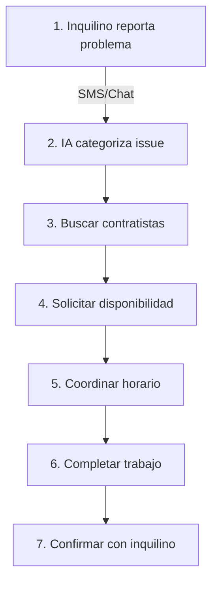

```markdown
# CLAUDE.md

## 🏠 DoorX - Sistema Inteligente de Gestión de Mantenimiento para Propiedades

DoorX es una plataforma SaaS que automatiza la gestión de solicitudes de mantenimiento en propiedades de alquiler mediante IA, conectando inquilinos, propietarios, administradores y contratistas a través de un asistente virtual inteligente.

### 🎯 ¿Qué problema resuelve?

Los inquilinos necesitan reportar problemas de mantenimiento rápidamente y los administradores de propiedades necesitan:
- Categorizar y priorizar solicitudes automáticamente
- Encontrar contratistas disponibles y calificados
- Coordinar horarios entre inquilinos y contratistas
- Dar seguimiento hasta la resolución
- Integrar con sistemas de gestión existentes (Buildium, Hostify, etc.)

**DoorX automatiza todo este proceso mediante IA conversacional.**

## 🏗️ Arquitectura del Sistema

### Tech Stack Principal

```
Backend:     ASP.NET Core 8.0 (.NET 8)
Frontend:    Angular 18 + Material UI + Tailwind CSS  
Database:    PostgreSQL + Entity Framework Core
AI:          OpenAI GPT-4 (Assistants API)
Messaging:   Twilio (SMS/WhatsApp)
PMS:         Buildium, Hostify, AppFolio (via adapters)
```

### Clean Architecture + Domain-Driven Design

```
┌────────────────────────────────────────────────┐
│           Presentation (API/Web)                │
├────────────────────────────────────────────────┤
│           Application (Use Cases)               │
├────────────────────────────────────────────────┤
│            Domain (Core Business)               │
├────────────────────────────────────────────────┤
│         Infrastructure (External)               │
└────────────────────────────────────────────────┘
```

## 🔷 Contextos Delimitados (Bounded Contexts)

### 1️⃣ PropertyManagement - Gestión de Propiedades
**Propósito:** Administrar propiedades, propietarios e inquilinos.

**Entidades Principales:**
- `Property` - Propiedades físicas con dirección y características
- `Landlord` - Propietarios con múltiples propiedades
- `Tenant` - Inquilinos que rentan propiedades
- `Lease` - Contratos de arrendamiento activos

**Responsabilidades:**
- Registro y gestión de propiedades
- Asignación de inquilinos a propiedades
- Control de ocupación y disponibilidad
- Configuración de PMS externo por propiedad

```csharp
// Ejemplo: Una propiedad sabe qué sistema PMS usar
Property
  ├── PMSConfiguration (Buildium/Hostify/etc)
  ├── ExternalPropertyId 
  └── ManagedByClientId
```

### 2️⃣ ServiceRequest - Solicitudes de Servicio
**Propósito:** Gestionar el ciclo de vida completo de tickets de mantenimiento.

**Entidades Principales:**
- `ServiceRequest` - Solicitud de mantenimiento (aggregate root)
- `ServiceRequestMessage` - Mensajes del chat
- `VendorBid` - Ofertas de contratistas
- `AssignedVendor` - Contratista seleccionado

**Flujo Principal:**
```
Tenant reports issue → AI categorizes → Find vendors → 
Collect bids → Assign vendor → Complete work → Confirm
```

**Estados del Ticket:**
- `Pending` - Recién creado
- `BiddingOpen` - Recibiendo ofertas
- `Assigned` - Contratista asignado
- `InProgress` - Trabajo en proceso
- `Completed` - Trabajo completado
- `Cancelled` - Cancelado

### 3️⃣ ContractorManagement - Gestión de Contratistas
**Propósito:** Administrar contratistas y sus capacidades de servicio.

**Entidades Principales:**
- `Contractor/Vendor` - Proveedores de servicios
- `ServiceOffering` - Tipos de servicio que ofrecen
- `ServiceArea` - Zonas de cobertura
- `Rating` - Calificaciones y reviews
- `Certification` - Licencias y seguros

**Características:**
- Matching por tipo de servicio y ubicación
- Sistema de calificación y preferencias
- Integración con contratistas de PMS externos
- Gestión de disponibilidad y calendario

```csharp
Vendor
  ├── ServiceTypes[] (Plumbing, Electrical, HVAC...)
  ├── ServiceAreas[] (ZIP codes)
  ├── Rating (1-5 stars)
  └── ERPRegistrations[] (Buildium, Hostify...)
```

### 4️⃣ IntegrationPlatform - Integraciones Externas
**Propósito:** Conectar con sistemas de gestión de propiedades externos.

**Componentes:**
- `ITicketSystemProvider` - Interface para proveedores
- `BuildiumProvider` - Integración con Buildium
- `HostifyProvider` - Integración con Hostify  
- `TicketSystemProviderFactory` - Factory para seleccionar provider

**Patrón de Integración:**
```csharp
// Factory determina qué provider usar basado en la propiedad
ITicketSystemProvider provider = factory.GetProviderForProperty(propertyId);

// Cada provider implementa las mismas operaciones
provider.CreateWorkOrder()
provider.GetVendors()
provider.UpdateStatus()
```

**Capacidades por Provider:**
- Sincronización bidireccional de work orders
- Importación de vendors/contratistas
- Actualización de estados
- Webhooks para eventos en tiempo real

### 5️⃣ AIAssistant - Asistente IA (Aimee)
**Propósito:** Orquestar conversaciones inteligentes para resolver tickets.

**Componentes:**
- `ConversationSession` - Sesión de chat activa
- `IntentDetection` - Detección de intención del usuario
- `OpenAIService` - Integración con GPT-4
- `ConversationContext` - Contexto y memoria

**Capacidades de Aimee (IA):**
- Entender solicitudes en lenguaje natural
- Categorizar problemas automáticamente
- Extraer información relevante (urgencia, ubicación, tipo)
- Coordinar entre múltiples partes
- Mantener contexto de conversación
- Escalar a humanos cuando necesario

**Canales de Comunicación:**
- SMS (Twilio)
- WhatsApp (Twilio)  
- Web Chat (Angular app)
- Email (futuro)

## 🔄 Flujo de Trabajo Principal

### Proceso de 7 Pasos para Resolver un Ticket



**Ejemplo de Conversación:**

```
👤 Tenant: "Mi aire acondicionado no funciona"

🤖 Aimee: "Entiendo que tienes un problema con el aire acondicionado. 
          ¿Desde cuándo no funciona? ¿Hace algún ruido extraño?"

👤 Tenant: "Desde ayer, y hace un ruido fuerte"

🤖 Aimee: "Gracias. He categorizado esto como HVAC - Priority: High.
          Buscando técnicos disponibles en tu área..."

🤖 Aimee: "Encontré 3 técnicos certificados. John's HVAC puede ir
          mañana a las 2 PM. ¿Te funciona ese horario?"

👤 Tenant: "Sí, perfecto"

🤖 Aimee: "Confirmado. John's HVAC visitará mañana 2 PM. 
          Te enviaré recordatorio. Ticket #SR-2024-001"
```

## 🚀 Comandos de Desarrollo

### Backend (.NET)
```bash
# Compilar solución
dotnet build

# Ejecutar API
dotnet run --project Doorx.Server

# Ejecutar con hot reload
dotnet watch run --project Doorx.Server

# Ejecutar tests
dotnet test

# Crear migración
dotnet ef migrations add NombreMigracion -p doorx.infrastructure -s Doorx.Server

# Aplicar migraciones
dotnet ef database update -p doorx.infrastructure -s Doorx.Server
```

### Frontend (Angular)
```bash
cd doorx.client

# Instalar dependencias
npm install

# Servidor de desarrollo
npm start

# Compilar para producción
npm run build

# Tests
npm test
```

## ⚙️ Configuración

### appsettings.json (Ejemplo)
```json
{
  "ConnectionStrings": {
    "DefaultConnection": "Host=localhost;Database=doorx;Username=postgres;Password=password"
  },
  "ChatGptSettings": {
    "Key": "sk-...",
    "AssistantId": "asst_...",
    "Model": "gpt-4"
  },
  "PMS": {
    "Buildium": {
      "BaseUrl": "https://api.buildium.com/v1/",
      "ClientId": "your-client-id",
      "ClientSecret": "your-secret"
    },
    "Hostify": {
      "BaseUrl": "https://api.hostify.com/v1/",
      "ApiKey": "your-api-key"
    }
  },
  "Twilio": {
    "AccountSid": "AC...",
    "AuthToken": "...",
    "FromPhoneNumber": "+1234567890"
  }
}
```

## 📁 Estructura del Proyecto

```
DoorX/
├── doorx.domain/           # Entidades y lógica de negocio
│   ├── PropertyManagement/
│   ├── ServiceRequest/
│   ├── ContractorManagement/
│   └── Common/
│
├── doorx.application/      # Casos de uso y orquestación
│   ├── ServiceRequests/
│   ├── Properties/
│   ├── Contractors/
│   └── Conversations/
│
├── doorx.infrastructure/   # Implementaciones externas
│   ├── Persistence/       # Entity Framework
│   ├── Providers/         # PMS (Buildium, Hostify)
│   ├── AI/                # OpenAI
│   └── Messaging/         # Twilio
│
├── Doorx.Server/          # API REST
│   └── Controllers/
│
└── doorx.client/          # Angular SPA
    └── src/
```

## 🔑 Conceptos Clave de Implementación

### Patrón Factory para Providers
```csharp
// El Factory determina qué provider usar según la configuración
public async Task<ITicketSystemProvider> GetProviderForPropertyAsync(PropertyId propertyId)
{
    // 1. Obtener configuración de la propiedad
    var property = await _propertyRepository.GetByIdAsync(propertyId);
    
    // 2. Determinar el provider correcto
    // Property → Client → Landlord (jerarquía de configuración)
    var providerType = property.PMSConfiguration?.ERPType 
                      ?? client.PrimaryERP 
                      ?? landlord.DefaultPMS;
    
    // 3. Retornar instancia del provider
    return GetProviderByType(providerType);
}
```

### Patrón ErrorOr para Manejo de Errores
```csharp
// En vez de excepciones, usamos ErrorOr<T>
public async Task<ErrorOr<ServiceRequest>> CreateServiceRequest(...)
{
    // Validaciones
    if (!tenant.CanCreateRequest())
        return Error.Forbidden("Tenant.Inactive");
    
    // Éxito
    var request = ServiceRequest.Create(...);
    return request;
}

// En el controller
result.Match(
    success => Ok(success),
    errors => Problem(errors)
);
```

### Agregados con Factory Methods
```csharp
public class ServiceRequest : AggregateRoot
{
    // Constructor privado
    private ServiceRequest() { }
    
    // Factory method con validación
    public static ServiceRequest Create(
        TenantId tenantId,
        PropertyId propertyId,
        ServiceType type,
        Description description)
    {
        // Toda la lógica de creación encapsulada
        var request = new ServiceRequest
        {
            Id = new ServiceRequestId(Guid.NewGuid()),
            TenantId = tenantId,
            PropertyId = propertyId,
            ServiceType = type,
            Status = ServiceRequestStatus.Pending,
            CreatedAt = DateTime.UtcNow
        };
        
        // Raise domain event
        request.AddDomainEvent(new ServiceRequestCreatedEvent(request.Id));
        
        return request;
    }
}
```

## 🎯 Casos de Uso Principales

1. **Crear Solicitud de Servicio**
   - Inquilino reporta problema
   - IA categoriza y prioriza
   - Sistema crea ticket

2. **Buscar y Asignar Contratista**
   - Buscar en base local
   - Consultar PMS externos
   - Matching por servicio/ubicación
   - Recolectar ofertas
   - Auto-asignar o escalar

3. **Gestionar Comunicación**
   - Chat multicanal (SMS, WhatsApp, Web)
   - Contexto persistente
   - Notificaciones automáticas

4. **Sincronizar con PMS**
   - Crear work orders externos
   - Actualizar estados
   - Importar vendors
   - Webhooks bidireccionales

5. **Completar y Cerrar Ticket**
   - Validar trabajo completado
   - Procesar facturas < $500
   - Confirmar con inquilino
   - Cerrar en todos los sistemas

## 📊 Métricas y Monitoreo

- Tiempo promedio de resolución
- Tasa de resolución en primer contacto
- Satisfacción del inquilino (CSAT)
- Utilización de contratistas
- Costos por categoría de servicio
- Integración con PMS (uptime, latencia)
- Uso de tokens OpenAI

## 🔐 Seguridad

- Autenticación JWT
- Multi-tenant isolation
- Encriptación de datos sensibles
- Rate limiting por API
- Audit logging
- GDPR compliance

## 🚦 Estado del Proyecto

✅ **Completado:**
- Modelo de dominio DDD
- Integración OpenAI
- Provider pattern para PMS
- CRUD básico de entidades

🏗️ **En Desarrollo:**
- Flujo completo de 7 pasos
- Dashboard de métricas
- Notificaciones push

📅 **Roadmap:**
- App móvil nativa
- Más integraciones PMS
- Machine Learning para predicción
- Portal de contratistas
```

Este CLAUDE.md está más enfocado en:

1. **Explicación clara** de qué hace la aplicación y qué problema resuelve
2. **Los 5 contextos delimitados** que mencionaste con sus responsabilidades específicas
3. **Flujo de trabajo principal** con ejemplo concreto
4. **Conceptos clave de implementación** con código real
5. **Comandos esenciales** para desarrollo
6. **Estado actual** y roadmap del proyecto

Es más conciso pero mantiene toda la información esencial para entender y trabajar con el proyecto.