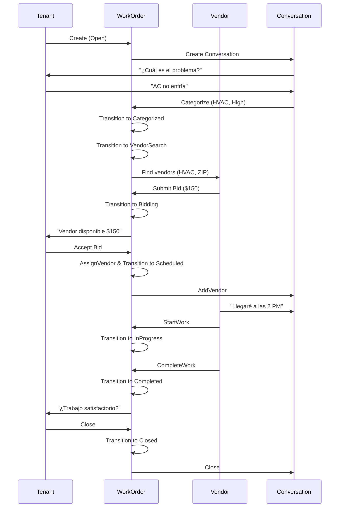

# DoorX - Modelo de Dominio

> Documentación completa del modelo de dominio con explicación de entidades, value objects, relaciones y reglas de negocio

## 📋 Tabla de Contenidos

1. [Visión General](#visión-general)
2. [Diagrama de Relaciones](#diagrama-de-relaciones)
3. [Aggregate Roots](#aggregate-roots)
4. [Value Objects](#value-objects)
5. [Domain Events](#domain-events)
6. [Relaciones entre Entidades](#relaciones-entre-entidades)
7. [Reglas de Negocio](#reglas-de-negocio)
8. [Ejemplos de Uso](#ejemplos-de-uso)

---

## 🎯 Visión General

El modelo de dominio de DoorX está diseñado siguiendo los principios de **Domain-Driven Design (DDD)** y se organiza en **5 Bounded Contexts** principales:

1. **Properties** - Gestión de propiedades
2. **Tenants** - Gestión de inquilinos
3. **Vendors** - Gestión de proveedores de servicio
4. **WorkOrders** - Órdenes de trabajo (núcleo del negocio)
5. **Conversations** - Comunicación multi-canal

### Principios Aplicados

✅ **Aggregate Pattern**: Cada agregado tiene un único punto de entrada (Aggregate Root)
✅ **Strongly-Typed IDs**: Todos los IDs son fuertemente tipados usando records
✅ **Immutability**: Value Objects son inmutables
✅ **Domain Events**: Cambios importantes publican eventos de dominio
✅ **Encapsulation**: Colecciones privadas con acceso de solo lectura
✅ **Validation**: Validación en el momento de creación usando ErrorOr<T>

---

## 📊 Diagrama de Relaciones

```
┌─────────────────────────────────────────────────────────────────────┐
│                        DOMAIN MODEL                                  │
└─────────────────────────────────────────────────────────────────────┘

        ┌──────────────┐
        │   Property   │ (Aggregate Root)
        └──────┬───────┘
               │
               │ 1:N
               │
        ┌──────▼───────┐
        │    Tenant    │ (Aggregate Root)
        └──────┬───────┘              ┌──────────────┐
               │                      │    Vendor    │ (Aggregate Root)
               │ 1:N                  └──────┬───────┘
               │                             │
        ┌──────▼───────┐                    │ 1:N (bids)
        │  WorkOrder   │ (Aggregate Root)   │
        │              │◄───────────────────┘
        │  ┌────────┐  │
        │  │VendorBid│ │ (Child Entity)
        │  └────────┘  │
        └──────┬───────┘
               │
               │ 1:1
               │
        ┌──────▼────────┐
        │ Conversation  │ (Aggregate Root)
        │               │
        │  ┌─────────┐  │
        │  │ Message │  │ (Child Entity)
        │  └─────────┘  │
        └───────────────┘

Legend:
━━━ Association (Reference by ID)
─── Composition (Contains child entities)
```

---

## 🏛️ Aggregate Roots

### 1. Property

**Bounded Context:** `Properties`
**Propósito:** Representa una propiedad física donde viven los inquilinos

**Ubicación:** `src/Domain/Properties/Entities/Property.cs`

#### Atributos

| Atributo | Tipo | Descripción |
|----------|------|-------------|
| Id | PropertyId | Identificador único |
| Name | string | Nombre de la propiedad (ej: "Building A - Unit 101") |
| Address | Address | Dirección física (Value Object) |
| PropertyType | PropertyType | Tipo de propiedad (Apartment, House, etc.) |
| ExternalPmsId | string? | ID externo del PMS |
| IsActive | bool | Si está activa para work orders |

#### Métodos Principales

```csharp
// Factory method
static ErrorOr<Property> Create(string name, Address address, PropertyType propertyType, string? externalPmsId = null)

// Business methods
ErrorOr<Success> Update(string name, Address address, PropertyType propertyType)
void Activate()
void Deactivate()
void SetExternalPmsId(string externalPmsId)
```

#### Invariantes

- ✅ El nombre no puede estar vacío
- ✅ La dirección debe ser válida
- ✅ Una propiedad desactivada no acepta nuevos work orders

---

### 2. Tenant

**Bounded Context:** `Tenants`
**Propósito:** Representa un inquilino que vive en una propiedad y puede reportar problemas

**Ubicación:** `src/Domain/Tenants/Entities/Tenant.cs`

#### Atributos

| Atributo | Tipo | Descripción |
|----------|------|-------------|
| Id | TenantId | Identificador único |
| FullName | string | Nombre completo |
| ContactInfo | ContactInfo | Email y teléfono (Value Object) |
| PropertyId | PropertyId | Propiedad donde vive |
| PreferredLanguage | Language | Idioma preferido (Value Object) |
| ExternalPmsId | string? | ID externo del PMS |
| IsActive | bool | Si la cuenta está activa |

#### Métodos Principales

```csharp
// Factory method
static ErrorOr<Tenant> Create(string fullName, ContactInfo contactInfo, PropertyId propertyId, Language preferredLanguage, string? externalPmsId = null)

// Business methods
ErrorOr<Success> UpdateContactInfo(ContactInfo contactInfo)
void UpdatePreferredLanguage(Language language)
void MoveTo(PropertyId newPropertyId)
void Activate()
void Deactivate()
```

#### Invariantes

- ✅ El nombre no puede estar vacío
- ✅ Debe tener información de contacto válida
- ✅ Debe estar asociado a una propiedad válida
- ✅ Solo inquilinos activos pueden crear work orders

#### Relaciones

- **Property (1:N)**: Un tenant vive en UNA propiedad, una propiedad puede tener MUCHOS tenants

---

### 3. Vendor

**Bounded Context:** `Vendors`
**Propósito:** Representa un proveedor de servicios de mantenimiento

**Ubicación:** `src/Domain/Vendors/Entities/Vendor.cs`

#### Atributos

| Atributo | Tipo | Descripción |
|----------|------|-------------|
| Id | VendorId | Identificador único |
| CompanyName | string | Nombre de la empresa/individuo |
| ContactInfo | ContactInfo | Email y teléfono (Value Object) |
| ServiceCategories | IReadOnlyCollection<ServiceCategory> | Servicios que ofrece |
| ServiceAreas | IReadOnlyCollection<ServiceArea> | Áreas de servicio (ZIP codes) |
| Rating | Rating | Calificación del vendor (Value Object) |
| IsAvailable | bool | Disponible para nuevos trabajos |
| IsActive | bool | Cuenta activa |
| ExternalPmsId | string? | ID externo del PMS |

#### Métodos Principales

```csharp
// Factory method
static ErrorOr<Vendor> Create(string companyName, ContactInfo contactInfo, string? externalPmsId = null)

// Service categories management
ErrorOr<Success> AddServiceCategory(ServiceCategory category)
ErrorOr<Success> RemoveServiceCategory(ServiceCategory category)

// Service areas management
ErrorOr<Success> AddServiceArea(ServiceArea area)
ErrorOr<Success> RemoveServiceArea(ServiceArea area)

// Business methods
bool CanService(ServiceCategory category, string zipCode)
ErrorOr<Success> UpdateContactInfo(ContactInfo contactInfo)
ErrorOr<Success> UpdateRating(Rating rating)
void SetAvailability(bool isAvailable)
void Activate()
void Deactivate()
```

#### Invariantes

- ✅ Debe tener al menos una categoría de servicio
- ✅ Debe tener al menos un área de servicio
- ✅ Un vendor desactivado no puede recibir work orders
- ✅ Un vendor no disponible no aparece en búsquedas
- ✅ No puede tener categorías de servicio duplicadas
- ✅ No puede tener áreas de servicio duplicadas

#### Colecciones Encapsuladas

```csharp
// ✅ CORRECTO: Lista privada con acceso de solo lectura
private readonly List<ServiceCategory> _serviceCategories = new();
public IReadOnlyCollection<ServiceCategory> ServiceCategories => _serviceCategories.AsReadOnly();

// ❌ INCORRECTO: Exponer lista mutable
public List<ServiceCategory> ServiceCategories { get; set; } // NUNCA HACER ESTO
```

---

### 4. WorkOrder (⭐ Núcleo del Dominio)

**Bounded Context:** `WorkOrders`
**Propósito:** Representa una solicitud de mantenimiento desde la creación hasta el cierre

**Ubicación:** `src/Domain/WorkOrders/Entities/WorkOrder.cs`

#### Atributos

| Atributo | Tipo | Descripción |
|----------|------|-------------|
| Id | WorkOrderId | Identificador único |
| TenantId | TenantId | Inquilino que reportó |
| PropertyId | PropertyId | Propiedad donde está el problema |
| IssueDescription | string | Descripción del problema |
| Category | ServiceCategory | Categoría del servicio |
| Priority | Priority | Nivel de urgencia |
| Status | WorkOrderStatus | Estado actual en el workflow |
| AssignedVendorId | VendorId? | Vendor asignado (opcional) |
| ScheduledFor | DateTime? | Fecha programada (opcional) |
| CompletedAt | DateTime? | Fecha de finalización (opcional) |
| Bids | IReadOnlyCollection<VendorBid> | Cotizaciones de vendors |
| ExternalPmsId | string? | ID externo del PMS |

#### Entidades Hijas

**VendorBid** (Child Entity) - Ver sección de Entidades Hijas

#### Métodos Principales

```csharp
// Factory method
static ErrorOr<WorkOrder> Create(TenantId tenantId, PropertyId propertyId, string issueDescription, ServiceCategory category, Priority priority, string? externalPmsId = null)

// State management
ErrorOr<Success> TransitionTo(WorkOrderStatus newStatus)

// Bid management
ErrorOr<Success> AddBid(VendorBid bid)

// Vendor assignment
ErrorOr<Success> AssignVendor(VendorId vendorId, DateTime scheduledFor)

// Workflow methods
ErrorOr<Success> StartWork()
ErrorOr<Success> CompleteWork()
ErrorOr<Success> Close()
ErrorOr<Success> Cancel(string reason)

// Updates
ErrorOr<Success> UpdateDescription(string newDescription)
ErrorOr<Success> UpdatePriority(Priority newPriority)
```

#### Workflow de Estados

```
Open → Categorized → VendorSearch → Bidding → Scheduled → InProgress → Completed → Closed
  │         │            │            │          │           │           │
  └─────────┴────────────┴────────────┴──────────┴───────────┴───────────┴──→ Cancelled
```

#### Reglas de Negocio Críticas

1. **Máximo 5 Bids**: Un work order puede tener máximo 5 cotizaciones de vendors
2. **Transiciones Válidas**: Solo se permiten transiciones de estado según el workflow
3. **Un Solo Vendor**: Solo un vendor puede estar asignado a la vez
4. **No Modificar Finalizados**: No se pueden modificar work orders cerrados o cancelados
5. **Bid Único por Vendor**: Un vendor solo puede enviar una cotización por work order

#### Invariantes

```csharp
// ✅ Validación de máximo de bids
if (_bids.Count >= MaxBidsAllowed)
    return Error.Validation("WorkOrder.AddBid", $"Maximum {MaxBidsAllowed} bids allowed");

// ✅ Validación de transición de estado
if (!Status.CanTransitionTo(newStatus))
    return Error.Validation("WorkOrder.Status", $"Invalid transition from {Status} to {newStatus}");

// ✅ Validación de vendor duplicado
if (_bids.Any(b => b.VendorId == bid.VendorId))
    return Error.Conflict("WorkOrder.AddBid", "Vendor has already submitted a bid");
```

#### Domain Events Publicados

- `WorkOrderCreatedEvent` - Cuando se crea el work order
- `WorkOrderStatusChangedEvent` - Cuando cambia el estado
- `VendorBidReceivedEvent` - Cuando se recibe una cotización
- `VendorAssignedEvent` - Cuando se asigna un vendor
- `WorkStartedEvent` - Cuando comienza el trabajo
- `WorkCompletedEvent` - Cuando se completa el trabajo
- `WorkOrderClosedEvent` - Cuando se cierra el work order
- `WorkOrderCancelledEvent` - Cuando se cancela
- `WorkOrderPriorityChangedEvent` - Cuando cambia la prioridad

#### Relaciones

- **Tenant (N:1)**: Un work order es creado por UN tenant
- **Property (N:1)**: Un work order pertenece a UNA propiedad
- **Vendor (N:1 opcional)**: Un work order puede tener UN vendor asignado
- **VendorBid (1:N)**: Un work order contiene MÚLTIPLES bids (máximo 5)
- **Conversation (1:1)**: Un work order tiene UNA conversación

---

### 5. Conversation

**Bounded Context:** `Conversations`
**Propósito:** Gestiona la comunicación multi-canal sobre un work order

**Ubicación:** `src/Domain/Conversations/Entities/Conversation.cs`

#### Atributos

| Atributo | Tipo | Descripción |
|----------|------|-------------|
| Id | ConversationId | Identificador único |
| WorkOrderId | WorkOrderId | Work order asociado |
| TenantId | TenantId | Tenant participante |
| VendorId | VendorId? | Vendor participante (opcional) |
| Messages | IReadOnlyCollection<Message> | Mensajes en la conversación |
| IsActive | bool | Si la conversación está activa |
| ClosedAt | DateTime? | Cuándo se cerró (opcional) |

#### Entidades Hijas

**Message** (Child Entity) - Ver sección de Entidades Hijas

#### Métodos Principales

```csharp
// Factory method
static ErrorOr<Conversation> Create(WorkOrderId workOrderId, TenantId tenantId)

// Participant management
ErrorOr<Success> AddVendor(VendorId vendorId)

// Message management
ErrorOr<Success> AddMessage(Message message)
ErrorOr<Success> AddMessage(string content, SenderType senderType, Channel channel)

// Message tracking
void MarkAllMessagesAsRead()
int GetUnreadMessageCount()
Message? GetLastMessage()

// Conversation lifecycle
ErrorOr<Success> Close()
ErrorOr<Success> Reopen()
```

#### Invariantes

- ✅ Una conversación debe estar asociada a un work order válido
- ✅ Solo una conversación activa puede recibir mensajes
- ✅ Un vendor solo puede agregarse una vez

#### Domain Events Publicados

- `ConversationStartedEvent` - Cuando inicia la conversación
- `VendorAddedToConversationEvent` - Cuando se agrega un vendor
- `MessageSentEvent` - Cuando se envía un mensaje
- `ConversationClosedEvent` - Cuando se cierra la conversación

#### Relaciones

- **WorkOrder (1:1)**: Una conversación pertenece a UN work order
- **Tenant (N:1)**: Una conversación incluye UN tenant
- **Vendor (N:1 opcional)**: Una conversación puede incluir UN vendor
- **Message (1:N)**: Una conversación contiene MÚLTIPLES mensajes

---

## 🧩 Entidades Hijas (Child Entities)

### VendorBid

**Aggregate:** WorkOrder
**Propósito:** Representa la cotización de un vendor para un work order

**Ubicación:** `src/Domain/WorkOrders/Entities/VendorBid.cs`

#### Atributos

| Atributo | Tipo | Descripción |
|----------|------|-------------|
| Id | VendorBidId | Identificador único |
| VendorId | VendorId | Vendor que envió la cotización |
| EstimatedCost | Money | Costo estimado (Value Object) |
| ProposedDate | DateTime? | Fecha propuesta para el trabajo |
| Notes | string? | Notas adicionales |
| SubmittedAt | DateTime | Cuándo se envió |
| IsAccepted | bool | Si fue aceptada |

#### Métodos

```csharp
static ErrorOr<VendorBid> Create(VendorId vendorId, Money estimatedCost, DateTime? proposedDate = null, string? notes = null)
ErrorOr<Success> Update(Money estimatedCost, DateTime? proposedDate, string? notes)
internal void Accept() // Solo puede ser llamado por WorkOrder
```

#### Reglas

- ❌ **NO tiene repositorio propio** (solo se accede a través de WorkOrder)
- ✅ No se puede modificar una bid aceptada
- ✅ Solo el Aggregate Root (WorkOrder) puede aceptar una bid

---

### Message

**Aggregate:** Conversation
**Propósito:** Representa un mensaje individual en una conversación

**Ubicación:** `src/Domain/Conversations/Entities/Message.cs`

#### Atributos

| Atributo | Tipo | Descripción |
|----------|------|-------------|
| Id | MessageId | Identificador único |
| Content | string | Contenido del mensaje |
| SenderType | SenderType | Quién envió (Tenant/Vendor/AI) |
| Channel | Channel | Canal usado (SMS/WhatsApp/Web) |
| SentAt | DateTime | Cuándo se envió |
| IsRead | bool | Si fue leído |
| ReadAt | DateTime? | Cuándo fue leído |

#### Métodos

```csharp
static ErrorOr<Message> Create(string content, SenderType senderType, Channel channel)
internal void MarkAsRead() // Solo puede ser llamado por Conversation
```

#### Reglas

- ❌ **NO tiene repositorio propio** (solo se accede a través de Conversation)
- ✅ El contenido no puede estar vacío
- ✅ Solo puede marcarse como leído una vez

---

## 💎 Value Objects

### IDs Fuertemente Tipados

Todos los IDs son Value Objects inmutables usando `record`:

```csharp
public record PropertyId(Guid Value)
{
    public static PropertyId CreateUnique() => new(Guid.NewGuid());
    public static PropertyId Empty => new(Guid.Empty);
    public override string ToString() => Value.ToString();
}
```

**Lista de IDs:**
- `PropertyId` - `src/Domain/Properties/ValueObjects/PropertyId.cs`
- `TenantId` - `src/Domain/Tenants/ValueObjects/TenantId.cs`
- `VendorId` - `src/Domain/Vendors/ValueObjects/VendorId.cs`
- `WorkOrderId` - `src/Domain/WorkOrders/ValueObjects/WorkOrderId.cs`
- `ConversationId` - `src/Domain/Conversations/ValueObjects/ConversationId.cs`
- `VendorBidId` - `src/Domain/WorkOrders/ValueObjects/VendorBidId.cs`
- `MessageId` - `src/Domain/Conversations/ValueObjects/MessageId.cs`

---

### Value Objects Complejos

#### Address

**Ubicación:** `src/Domain/Properties/ValueObjects/Address.cs`

```csharp
public record Address
{
    public string Street { get; init; }
    public string? Unit { get; init; }
    public string City { get; init; }
    public string State { get; init; }
    public string ZipCode { get; init; }
    public string Country { get; init; }
}
```

**Validaciones:**
- Street, City, State, ZipCode son requeridos
- Unit es opcional
- Incluye método `GetFullAddress()` para formato completo

---

#### ContactInfo

**Ubicación:** `src/Domain/Common/ValueObjects/ContactInfo.cs`

```csharp
public partial record ContactInfo
{
    public string Email { get; init; }
    public string? PhoneNumber { get; init; }
}
```

**Validaciones:**
- Email es requerido y debe tener formato válido
- PhoneNumber es opcional pero si se proporciona debe ser válido
- Email se normaliza a minúsculas

---

#### ServiceCategory

**Ubicación:** `src/Domain/WorkOrders/ValueObjects/ServiceCategory.cs`

**Valores válidos:**
- Plumbing
- Electrical
- HVAC
- Appliance
- PestControl
- Cleaning
- GeneralMaintenance

```csharp
var category = ServiceCategory.Plumbing;
// o
var categoryResult = ServiceCategory.Create("Plumbing");
```

---

#### Priority

**Ubicación:** `src/Domain/WorkOrders/ValueObjects/Priority.cs`

**Valores:**

| Priority | Response Time | Use Case |
|----------|---------------|----------|
| Emergency | 24 hours | Sin agua, sin electricidad, seguridad |
| High | 48 hours | Problemas mayores |
| Normal | 120 hours (5 días) | Reparaciones estándar |
| Low | 168 hours (7 días) | Mejoras cosméticas |

```csharp
public record Priority
{
    public string Value { get; init; }
    public int ExpectedResponseHours { get; init; }

    public static Priority Emergency => new("Emergency", 24);
    public bool IsEmergency() => Value == "Emergency";
}
```

---

#### WorkOrderStatus

**Ubicación:** `src/Domain/WorkOrders/ValueObjects/WorkOrderStatus.cs`

**Estados y Transiciones:**

```csharp
Open → Categorized → VendorSearch → Bidding → Scheduled → InProgress → Completed → Closed
  └──────────────────────────────────────────────────────────────────────────→ Cancelled
```

**Métodos:**
- `CanTransitionTo(WorkOrderStatus newStatus)` - Valida transiciones
- `IsFinalState()` - Indica si es Closed o Cancelled
- `IsActive()` - Indica si no es final

---

#### Money

**Ubicación:** `src/Domain/WorkOrders/ValueObjects/Money.cs`

```csharp
public record Money
{
    public decimal Amount { get; init; }
    public string Currency { get; init; }

    public static Money Zero => new(0, "USD");
}
```

**Validaciones:**
- Amount no puede ser negativo
- Currency es requerido (default: USD)

---

#### Rating

**Ubicación:** `src/Domain/Vendors/ValueObjects/Rating.cs`

```csharp
public record Rating
{
    public decimal Value { get; init; }      // 0-5
    public int TotalReviews { get; init; }

    public static Rating Unrated => new(0, 0);
    public bool IsUnrated() => TotalReviews == 0;
}
```

**Validaciones:**
- Value debe estar entre 0 y 5
- TotalReviews no puede ser negativo

---

#### Language

**Ubicación:** `src/Domain/Common/ValueObjects/Language.cs`

**Idiomas soportados:**
- English (en)
- Spanish (es)
- French (fr)
- Portuguese (pt)

```csharp
var language = Language.Spanish;
// o
var langResult = Language.Create("es");
```

---

#### Channel

**Ubicación:** `src/Domain/Conversations/ValueObjects/Channel.cs`

**Canales válidos:**
- SMS
- WhatsApp
- WebChat
- Email

---

#### SenderType

**Ubicación:** `src/Domain/Conversations/ValueObjects/SenderType.cs`

**Tipos válidos:**
- Tenant
- Vendor
- AI (Aimee)
- PropertyManager

---

## 📡 Domain Events

Los Domain Events capturan hechos importantes que ocurrieron en el dominio. Son inmutables y se publican después de que el agregado se persiste exitosamente.

### Estructura Base

Todos los eventos implementan `IDomainEvent`:

```csharp
public interface IDomainEvent
{
    Guid EventId { get; }
    DateTime OccurredOnUtc { get; }
}
```

### Eventos de WorkOrder

**Ubicación:** `src/Domain/WorkOrders/Events/`

| Evento | Cuándo se Publica | Datos |
|--------|-------------------|-------|
| `WorkOrderCreatedEvent` | Al crear un work order | WorkOrderId, TenantId, PropertyId, Category, Priority |
| `WorkOrderStatusChangedEvent` | Al cambiar de estado | WorkOrderId, OldStatus, NewStatus |
| `VendorBidReceivedEvent` | Al recibir una cotización | WorkOrderId, VendorId, EstimatedCost |
| `VendorAssignedEvent` | Al asignar un vendor | WorkOrderId, VendorId, ScheduledFor |
| `WorkStartedEvent` | Al iniciar el trabajo | WorkOrderId, VendorId |
| `WorkCompletedEvent` | Al completar el trabajo | WorkOrderId, VendorId, CompletedAt |
| `WorkOrderClosedEvent` | Al cerrar el work order | WorkOrderId, TenantId |
| `WorkOrderCancelledEvent` | Al cancelar | WorkOrderId, Reason |
| `WorkOrderPriorityChangedEvent` | Al cambiar prioridad | WorkOrderId, OldPriority, NewPriority |

### Eventos de Conversation

**Ubicación:** `src/Domain/Conversations/Events/`

| Evento | Cuándo se Publica | Datos |
|--------|-------------------|-------|
| `ConversationStartedEvent` | Al iniciar conversación | ConversationId, WorkOrderId, TenantId |
| `VendorAddedToConversationEvent` | Al agregar vendor | ConversationId, VendorId |
| `MessageSentEvent` | Al enviar mensaje | ConversationId, MessageId, SenderType, Channel |
| `ConversationClosedEvent` | Al cerrar conversación | ConversationId, WorkOrderId |

### Ejemplo de Uso

```csharp
// En WorkOrder.cs
public static ErrorOr<WorkOrder> Create(...)
{
    var workOrder = new WorkOrder(...);

    // Publicar evento de dominio
    workOrder.AddDomainEvent(new WorkOrderCreatedEvent(
        workOrder.Id,
        tenantId,
        propertyId,
        category,
        priority
    ));

    return workOrder;
}

// Los eventos se publican automáticamente después de guardar en el repositorio
```

---

## 🔗 Relaciones entre Entidades

### Resumen de Relaciones

```
Property (1) ──────< (N) Tenant
   │
   │
Tenant (1) ──────< (N) WorkOrder
   │
   │
WorkOrder (1) ────── (1) Conversation
   │                      │
   │                      │
   ├──< (N) VendorBid     ├──< (N) Message
   │
   │
Vendor (1) ──────< (N) VendorBid
```

### Tipos de Relaciones

#### 1. Asociación por Referencia (ID)

Las entidades se relacionan mediante IDs fuertemente tipados:

```csharp
public class Tenant : AggregateRoot<TenantId>
{
    public PropertyId PropertyId { get; private set; } // Referencia a Property
}
```

**Características:**
- No hay navegación directa entre objetos
- Se usa el ID para obtener la entidad relacionada del repositorio
- Mantiene bajo acoplamiento entre agregados

#### 2. Composición (Agregados)

Las entidades hijas existen solo dentro de su agregado:

```csharp
public class WorkOrder : AggregateRoot<WorkOrderId>
{
    private readonly List<VendorBid> _bids = new(); // Composición
    public IReadOnlyCollection<VendorBid> Bids => _bids.AsReadOnly();
}
```

**Características:**
- Las entidades hijas no tienen repositorio propio
- Solo se acceden a través del Aggregate Root
- Se cargan y persisten junto con el agregado

---

### Matriz de Relaciones

| De | A | Tipo | Cardinalidad | Navegación |
|----|---|------|--------------|------------|
| Property | Tenant | Asociación | 1:N | No directa (query) |
| Tenant | WorkOrder | Asociación | 1:N | No directa (query) |
| Property | WorkOrder | Asociación | 1:N | No directa (query) |
| WorkOrder | VendorBid | Composición | 1:N | Directa (colección) |
| Vendor | WorkOrder | Asociación | 1:N | No directa (query) |
| WorkOrder | Conversation | Asociación | 1:1 | No directa (query) |
| Conversation | Message | Composición | 1:N | Directa (colección) |
| Tenant | Conversation | Asociación | 1:N | No directa (query) |
| Vendor | Conversation | Asociación | 1:N | No directa (query) |

---

## ⚖️ Reglas de Negocio

### Reglas de WorkOrder

#### RN-1: Máximo de Cotizaciones
- ✅ Un work order puede tener **máximo 5 cotizaciones** de vendors
- ⚠️ Al intentar agregar una 6ta cotización se retorna un error

```csharp
if (_bids.Count >= MaxBidsAllowed)
    return Error.Validation("WorkOrder.AddBid", "Maximum 5 bids allowed per work order");
```

#### RN-2: Transiciones de Estado Válidas
- ✅ Solo se permiten transiciones según el workflow definido
- ⚠️ No se puede saltar estados arbitrariamente

```csharp
if (!Status.CanTransitionTo(newStatus))
    return Error.Validation("WorkOrder.Status", $"Invalid transition from {Status} to {newStatus}");
```

#### RN-3: Un Vendor por Work Order
- ✅ Solo UN vendor puede estar asignado a un work order
- ✅ Un vendor solo puede enviar UNA cotización por work order

```csharp
if (_bids.Any(b => b.VendorId == bid.VendorId))
    return Error.Conflict("WorkOrder.AddBid", "Vendor has already submitted a bid");
```

#### RN-4: Inmutabilidad de Estados Finales
- ✅ No se pueden modificar work orders en estado Closed o Cancelled
- ⚠️ Esto incluye descripción, prioridad, bids, etc.

```csharp
if (Status.IsFinalState())
    return Error.Validation("WorkOrder.Update", "Cannot modify finalized work order");
```

#### RN-5: Vendor Asignado Requiere Bid
- ✅ Solo se puede asignar un vendor que haya enviado una cotización
- ⚠️ No se puede asignar un vendor arbitrariamente

```csharp
var bid = _bids.FirstOrDefault(b => b.VendorId == vendorId);
if (bid is null)
    return Error.NotFound("WorkOrder.AssignVendor", "No bid found from this vendor");
```

### Reglas de Vendor

#### RN-6: Vendor Debe Tener Capacidades
- ✅ Un vendor debe tener al menos UNA categoría de servicio
- ✅ Un vendor debe tener al menos UN área de servicio
- ⚠️ Sin categorías o áreas, el vendor no puede recibir trabajo

```csharp
public bool CanService(ServiceCategory category, string zipCode)
{
    if (!IsActive || !IsAvailable)
        return false;

    var hasCategory = _serviceCategories.Contains(category);
    var hasArea = _serviceAreas.Any(a => a.ZipCode == zipCode);

    return hasCategory && hasArea;
}
```

### Reglas de Conversation

#### RN-7: Un Vendor por Conversación
- ✅ Solo UN vendor puede participar en una conversación
- ⚠️ No se permite cambiar el vendor una vez agregado

```csharp
if (VendorId is not null && VendorId != vendorId)
    return Error.Validation("Conversation.AddVendor", "Conversation already has a different vendor");
```

#### RN-8: Solo Conversaciones Activas Reciben Mensajes
- ✅ Solo se pueden agregar mensajes a conversaciones activas
- ⚠️ Conversaciones cerradas no aceptan nuevos mensajes

```csharp
if (!IsActive)
    return Error.Validation("Conversation.AddMessage", "Cannot add messages to inactive conversation");
```

---

## 📚 Ejemplos de Uso

### Ejemplo 1: Crear un Work Order Completo

```csharp
// 1. Crear property
var addressResult = Address.Create("123 Main St", "Apt 4B", "Miami", "FL", "33101");
var address = addressResult.Value;

var propertyResult = Property.Create("Sunset Apartments - Unit 4B", address, PropertyType.Apartment);
var property = propertyResult.Value;

// 2. Crear tenant
var contactResult = ContactInfo.Create("john@email.com", "+1-305-555-1234");
var contact = contactResult.Value;

var tenantResult = Tenant.Create("John Doe", contact, property.Id, Language.English);
var tenant = tenantResult.Value;

// 3. Crear work order
var workOrderResult = WorkOrder.Create(
    tenant.Id,
    property.Id,
    "El aire acondicionado no enfría. Hace ruido extraño.",
    ServiceCategory.HVAC,
    Priority.High
);
var workOrder = workOrderResult.Value;

// 4. Transicionar a Categorized (IA procesó)
workOrder.TransitionTo(WorkOrderStatus.Categorized);

// 5. Buscar vendors y transicionar
workOrder.TransitionTo(WorkOrderStatus.VendorSearch);
workOrder.TransitionTo(WorkOrderStatus.Bidding);

// 6. Vendors envían cotizaciones
var vendor1BidResult = VendorBid.Create(
    vendor1Id,
    Money.Create(150, "USD").Value,
    DateTime.UtcNow.AddDays(1),
    "Puedo ir mañana a las 2 PM"
);
workOrder.AddBid(vendor1BidResult.Value);

var vendor2BidResult = VendorBid.Create(
    vendor2Id,
    Money.Create(125, "USD").Value,
    DateTime.UtcNow.AddDays(2),
    "Disponible pasado mañana por la mañana"
);
workOrder.AddBid(vendor2BidResult.Value);

// 7. Asignar vendor (acepta bid)
var scheduledDate = DateTime.UtcNow.AddDays(1).AddHours(14); // Mañana 2 PM
workOrder.AssignVendor(vendor1Id, scheduledDate);
// Estado automáticamente cambia a Scheduled

// 8. Vendor comienza el trabajo
workOrder.StartWork();
// Estado cambia a InProgress

// 9. Vendor completa el trabajo
workOrder.CompleteWork();
// Estado cambia a Completed

// 10. Tenant confirma satisfacción
workOrder.Close();
// Estado cambia a Closed

// Domain Events publicados durante el proceso:
// - WorkOrderCreatedEvent
// - WorkOrderStatusChangedEvent (múltiples veces)
// - VendorBidReceivedEvent (2 veces)
// - VendorAssignedEvent
// - WorkStartedEvent
// - WorkCompletedEvent
// - WorkOrderClosedEvent
```

### Ejemplo 2: Gestionar una Conversación

```csharp
// 1. Crear conversación cuando se crea el work order
var conversationResult = Conversation.Create(workOrder.Id, tenant.Id);
var conversation = conversationResult.Value;

// 2. Tenant envía mensaje inicial
conversation.AddMessage(
    "Mi aire acondicionado no está enfriando",
    SenderType.Tenant,
    Channel.SMS
);

// 3. IA responde
conversation.AddMessage(
    "Entiendo. ¿El AC hace algún ruido inusual?",
    SenderType.AI,
    Channel.SMS
);

// 4. Tenant responde
conversation.AddMessage(
    "Sí, hace un ruido de zumbido",
    SenderType.Tenant,
    Channel.SMS
);

// 5. Cuando se asigna vendor, agregarlo a la conversación
conversation.AddVendor(assignedVendorId);

// 6. Vendor se comunica
conversation.AddMessage(
    "Hola, llegaré mañana a las 2 PM",
    SenderType.Vendor,
    Channel.WhatsApp
);

// 7. Tenant confirma
conversation.AddMessage(
    "Perfecto, gracias",
    SenderType.Tenant,
    Channel.WhatsApp
);

// 8. Ver mensajes no leídos
var unreadCount = conversation.GetUnreadMessageCount();

// 9. Marcar todos como leídos
conversation.MarkAllMessagesAsRead();

// 10. Obtener último mensaje
var lastMessage = conversation.GetLastMessage();

// 11. Cerrar conversación cuando se cierra el work order
conversation.Close();

// Domain Events publicados:
// - ConversationStartedEvent
// - MessageSentEvent (múltiples veces)
// - VendorAddedToConversationEvent
// - ConversationClosedEvent
```

### Ejemplo 3: Gestionar Vendor con Servicios

```csharp
// 1. Crear vendor
var vendorContactResult = ContactInfo.Create("acrepairs@email.com", "+1-305-555-9999");
var vendorContact = vendorContactResult.Value;

var vendorResult = Vendor.Create("AC Repairs Inc", vendorContact);
var vendor = vendorResult.Value;

// 2. Agregar categorías de servicio
vendor.AddServiceCategory(ServiceCategory.HVAC);
vendor.AddServiceCategory(ServiceCategory.Electrical);
vendor.AddServiceCategory(ServiceCategory.Appliance);

// 3. Agregar áreas de servicio (ZIP codes)
vendor.AddServiceArea(ServiceArea.Create("33101").Value);
vendor.AddServiceArea(ServiceArea.Create("33102").Value);
vendor.AddServiceArea(ServiceArea.Create("33103").Value);

// 4. Verificar si puede servir un work order
var canService = vendor.CanService(ServiceCategory.HVAC, "33101"); // true
var cannotService = vendor.CanService(ServiceCategory.Plumbing, "33101"); // false (no tiene esa categoría)
var outsideArea = vendor.CanService(ServiceCategory.HVAC, "90210"); // false (fuera del área)

// 5. Actualizar rating después de trabajo completado
var newRating = Rating.Create(4.5m, 23).Value; // 4.5 estrellas con 23 reviews
vendor.UpdateRating(newRating);

// 6. Marcar como no disponible temporalmente
vendor.SetAvailability(false);

// Ahora NO aparecerá en búsquedas
var stillCanService = vendor.CanService(ServiceCategory.HVAC, "33101"); // false (no disponible)

// 7. Reactivar
vendor.SetAvailability(true);
```

### Ejemplo 4: Manejo de Errores con ErrorOr

```csharp
// ✅ Patrón recomendado: ErrorOr<T>
var workOrderResult = WorkOrder.Create(
    tenantId,
    propertyId,
    "", // ❌ Descripción vacía - causará error
    ServiceCategory.HVAC,
    Priority.High
);

if (workOrderResult.IsError)
{
    // Manejar error
    var error = workOrderResult.FirstError;
    Console.WriteLine($"Error: {error.Code} - {error.Description}");
    // Output: "Error: WorkOrder.IssueDescription - Issue description is required"
    return;
}

// Acceder al valor solo si no hay error
var workOrder = workOrderResult.Value;

// ✅ Ejemplo con transición inválida
var transitionResult = workOrder.TransitionTo(WorkOrderStatus.Completed);
// ❌ Falla porque está en estado Open y no puede saltar a Completed

if (transitionResult.IsError)
{
    Console.WriteLine(transitionResult.FirstError.Description);
    // Output: "Invalid transition from Open to Completed"
}

// ✅ Ejemplo con máximo de bids
for (int i = 0; i < 6; i++)
{
    var bidResult = VendorBid.Create(vendorId, Money.Zero);
    var addResult = workOrder.AddBid(bidResult.Value);

    if (addResult.IsError)
    {
        Console.WriteLine(addResult.FirstError.Description);
        // Output en la 6ta iteración: "Maximum 5 bids allowed per work order"
    }
}
```

---

## 🎯 Mejores Prácticas

### 1. Siempre Usar Factory Methods

```csharp
// ✅ CORRECTO
var workOrder = WorkOrder.Create(tenantId, propertyId, description, category, priority);

// ❌ INCORRECTO
var workOrder = new WorkOrder(); // Constructor privado, no compilará
```

### 2. No Exponer Colecciones Mutables

```csharp
// ✅ CORRECTO
private readonly List<VendorBid> _bids = new();
public IReadOnlyCollection<VendorBid> Bids => _bids.AsReadOnly();

// ❌ INCORRECTO
public List<VendorBid> Bids { get; set; }
```

### 3. Validar en el Método, No en el Constructor

```csharp
// ✅ CORRECTO
public static ErrorOr<WorkOrder> Create(...)
{
    if (string.IsNullOrWhiteSpace(issueDescription))
        return Error.Validation("WorkOrder.IssueDescription", "Issue description is required");

    return new WorkOrder(...);
}

// ❌ INCORRECTO
public WorkOrder(...)
{
    if (string.IsNullOrWhiteSpace(issueDescription))
        throw new ArgumentException(...); // No usar excepciones para validación de dominio
}
```

### 4. Usar ErrorOr en Lugar de Excepciones

```csharp
// ✅ CORRECTO
public ErrorOr<Success> AddBid(VendorBid bid)
{
    if (_bids.Count >= MaxBidsAllowed)
        return Error.Validation("WorkOrder.AddBid", "Maximum 5 bids allowed");

    _bids.Add(bid);
    return Result.Success;
}

// ❌ INCORRECTO
public void AddBid(VendorBid bid)
{
    if (_bids.Count >= MaxBidsAllowed)
        throw new InvalidOperationException("Maximum 5 bids allowed");

    _bids.Add(bid);
}
```

### 5. Publicar Domain Events en Cambios Importantes

```csharp
// ✅ CORRECTO
public ErrorOr<Success> CompleteWork()
{
    var transitionResult = TransitionTo(WorkOrderStatus.Completed);
    if (transitionResult.IsError)
        return transitionResult.Errors;

    CompletedAt = DateTime.UtcNow;

    // Publicar evento
    AddDomainEvent(new WorkCompletedEvent(Id, AssignedVendorId.Value, CompletedAt.Value));

    return Result.Success;
}
```

### 6. Mantener Invariantes del Agregado

```csharp
// ✅ El Aggregate Root garantiza invariantes
public ErrorOr<Success> AssignVendor(VendorId vendorId, DateTime scheduledFor)
{
    // Validar estado
    if (Status == WorkOrderStatus.Cancelled)
        return Error.Validation("WorkOrder.AssignVendor", "Cannot assign vendor to cancelled work order");

    // Validar que existe bid del vendor
    var bid = _bids.FirstOrDefault(b => b.VendorId == vendorId);
    if (bid is null)
        return Error.NotFound("WorkOrder.AssignVendor", "No bid found from this vendor");

    // Validar fecha
    if (scheduledFor <= DateTime.UtcNow)
        return Error.Validation("WorkOrder.ScheduledFor", "Scheduled date must be in the future");

    // Todo válido, hacer cambios
    AssignedVendorId = vendorId;
    ScheduledFor = scheduledFor;
    bid.Accept();

    return Result.Success;
}
```

---

## 📍 Ubicación de Archivos

```
src/Domain/
├── Common/
│   ├── Entity.cs
│   ├── AggregateRoot.cs
│   ├── AuditableEntity.cs
│   ├── ValueObject.cs
│   ├── Interfaces/
│   │   ├── IRepository.cs
│   │   └── IDomainEvent.cs
│   ├── Errors/
│   │   └── DomainErrors.cs
│   └── ValueObjects/
│       ├── ContactInfo.cs
│       └── Language.cs
│
├── Properties/
│   ├── Entities/
│   │   └── Property.cs
│   └── ValueObjects/
│       ├── PropertyId.cs
│       └── Address.cs
│
├── Tenants/
│   ├── Entities/
│   │   └── Tenant.cs
│   └── ValueObjects/
│       └── TenantId.cs
│
├── Vendors/
│   ├── Entities/
│   │   └── Vendor.cs
│   └── ValueObjects/
│       ├── VendorId.cs
│       ├── ServiceArea.cs
│       └── Rating.cs
│
├── WorkOrders/
│   ├── Entities/
│   │   ├── WorkOrder.cs
│   │   └── VendorBid.cs
│   ├── ValueObjects/
│   │   ├── WorkOrderId.cs
│   │   ├── VendorBidId.cs
│   │   ├── ServiceCategory.cs
│   │   ├── Priority.cs
│   │   ├── WorkOrderStatus.cs
│   │   └── Money.cs
│   └── Events/
│       ├── WorkOrderCreatedEvent.cs
│       ├── WorkOrderStatusChangedEvent.cs
│       ├── VendorBidReceivedEvent.cs
│       ├── VendorAssignedEvent.cs
│       ├── WorkStartedEvent.cs
│       ├── WorkCompletedEvent.cs
│       ├── WorkOrderClosedEvent.cs
│       ├── WorkOrderCancelledEvent.cs
│       └── WorkOrderPriorityChangedEvent.cs
│
└── Conversations/
    ├── Entities/
    │   ├── Conversation.cs
    │   └── Message.cs
    ├── ValueObjects/
    │   ├── ConversationId.cs
    │   ├── MessageId.cs
    │   ├── Channel.cs
    │   └── SenderType.cs
    └── Events/
        ├── ConversationStartedEvent.cs
        ├── VendorAddedToConversationEvent.cs
        ├── MessageSentEvent.cs
        └── ConversationClosedEvent.cs
```

---

## 🔄 Flujo Completo de un Work Order



---

**Última actualización**: 2024-11-24
**Versión**: 1.0.0
**Autor**: DoorX Development Team
