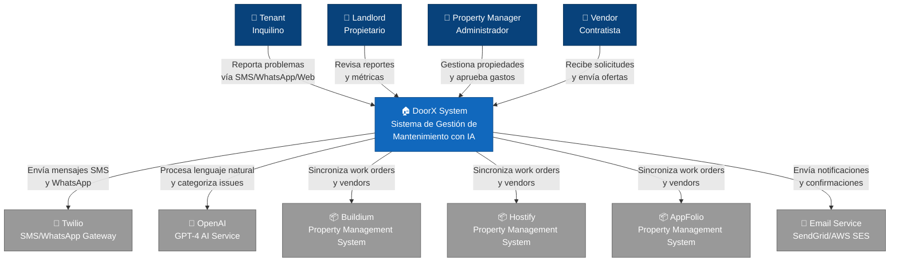

# DoorX - Context Diagram (C4 Level 1)

## Descripción

Diagrama de contexto del sistema DoorX mostrando los actores externos (usuarios y sistemas) que interactúan con la plataforma.

**Nivel:** C4 Level 1 - System Context
**Audiencia:** Todos los stakeholders (técnicos y no técnicos)
**Propósito:** Vista general del sistema y sus interacciones externas

---

## Diagrama



---

## Actores

### 👥 Usuarios Humanos

| Actor | Rol | Interacción Principal |
|-------|-----|----------------------|
| **Tenant** (Inquilino) | Usuario final que reporta problemas de mantenimiento | Reporta issues vía SMS, WhatsApp o web chat |
| **Landlord** (Propietario) | Dueño de propiedades | Visualiza métricas y reportes de sus propiedades |
| **Property Manager** (Administrador) | Gestiona múltiples propiedades para propietarios | Coordina mantenimiento, aprueba gastos, gestiona vendors |
| **Vendor** (Contratista) | Proveedor de servicios de mantenimiento | Recibe notificaciones, envía ofertas, completa trabajos |

### 🔗 Sistemas Externos

| Sistema | Propósito | Protocolo |
|---------|-----------|-----------|
| **Buildium** | Property Management System | REST API + Webhooks |
| **Hostify** | Property Management System | REST API + Webhooks |
| **AppFolio** | Property Management System | REST API + Webhooks |
| **Twilio** | Gateway de mensajería SMS/WhatsApp | REST API + Webhooks |
| **OpenAI GPT-4** | Procesamiento de lenguaje natural y categorización | REST API |
| **Email Service** | Notificaciones y confirmaciones por email | SMTP/API |

---

## Flujos Principales

### 1. 📥 Reporte de Problema
```
Tenant → SMS/WhatsApp (Twilio) → DoorX → OpenAI (análisis) → Categorización
```

### 2. 🔄 Sincronización con PMS
```
DoorX ↔ Buildium/Hostify/AppFolio (bidireccional)
  - Export: Work orders creados en DoorX
  - Import: Vendors y propiedades desde PMS
```

### 3. 🤖 Conversación con IA
```
Tenant → Mensaje → DoorX → OpenAI (GPT-4) → Respuesta inteligente → Tenant
```

### 4. 📱 Notificaciones
```
DoorX → Twilio → SMS/WhatsApp → Usuario
DoorX → Email Service → Email → Usuario
```

---

## Decisiones de Arquitectura

### ¿Por qué múltiples PMS?
Diferentes clientes (landlords/property managers) usan distintos sistemas de gestión. DoorX actúa como capa de integración universal mediante un patrón Factory/Adapter.

### ¿Por qué Twilio?
- Soporte robusto para SMS y WhatsApp
- APIs confiables y bien documentadas
- Webhooks para mensajes entrantes

### ¿Por qué OpenAI GPT-4?
- Procesamiento de lenguaje natural avanzado
- Capacidad de mantener contexto conversacional
- API de Assistants con memory y function calling

---

## Siguiente Nivel

📍 **Estás aquí:** C4 Level 1 - Context Diagram
📖 **Siguiente:** [02-container-diagram.md](./02-container-diagram.md) - Descomposición en aplicaciones y servicios

---

## Referencias

- [C4 Model Documentation](https://c4model.com/)
- [DoorX Architecture](../../ARCHITECTURE.md)
- [DoorX Domain Model](../../DOMAIN_MODEL.md)
