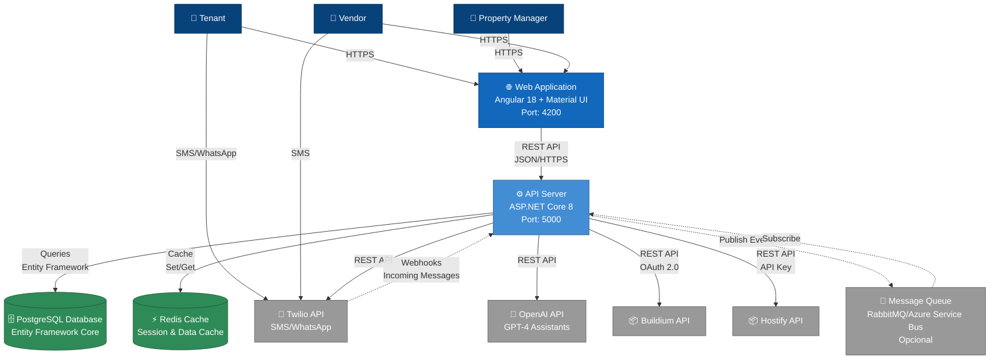
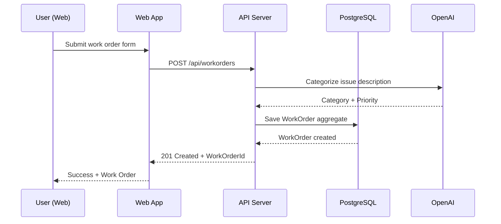
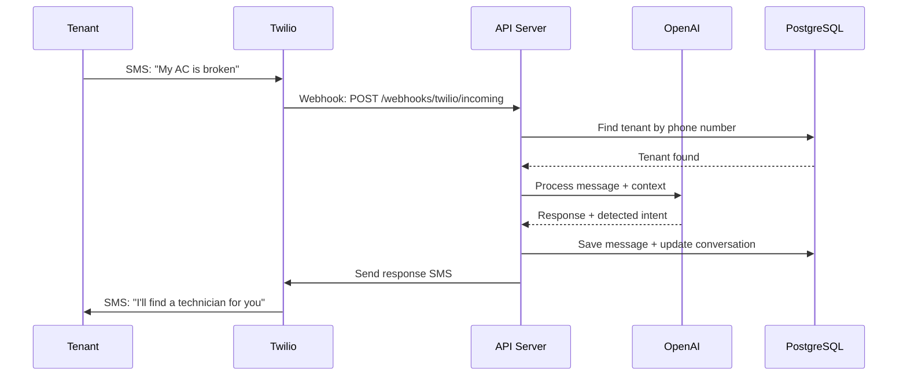

# DoorX - Container Diagram (C4 Level 2)

## Descripción

Diagrama de contenedores mostrando las aplicaciones y servicios principales que componen el sistema DoorX y cómo se comunican entre sí.

**Nivel:** C4 Level 2 - Container Diagram
**Audiencia:** Arquitectos de software, desarrolladores
**Propósito:** Mostrar la arquitectura técnica de alto nivel y las tecnologías principales

---

## Diagrama



---

## Contenedores (Containers)

### 🌐 Web Application (Frontend)

| Aspecto | Detalle |
|---------|---------|
| **Tecnología** | Angular 18, TypeScript, Material UI, Tailwind CSS |
| **Propósito** | Single Page Application (SPA) para usuarios |
| **Puerto** | 4200 (desarrollo), 443 (producción) |
| **Responsabilidades** | - UI/UX para todos los usuarios<br/>- Chat en tiempo real<br/>- Dashboards y reportes<br/>- Gestión de propiedades y vendors |

**Características principales:**
- Responsive design (mobile-first)
- Real-time chat con WebSockets (SignalR)
- Progressive Web App (PWA) capabilities
- Autenticación JWT

---

### ⚙️ API Server (Backend)

| Aspecto | Detalle |
|---------|---------|
| **Tecnología** | ASP.NET Core 8, C# 12, .NET 8 |
| **Arquitectura** | Clean Architecture + DDD |
| **Puerto** | 5000 (HTTP), 5001 (HTTPS) |
| **Responsabilidades** | - REST API endpoints<br/>- Business logic orchestration<br/>- Domain model enforcement<br/>- Integration with external services |

**Capas internas:**
```
API Layer (Presentation)
  ↓
Application Layer (Use Cases)
  ↓
Domain Layer (Business Rules)
  ↓
Infrastructure Layer (External Services)
```

**Características principales:**
- RESTful API design
- JWT authentication + Role-based authorization
- OpenAPI/Swagger documentation
- CQRS pattern (Command Query Responsibility Segregation)
- Repository pattern + Unit of Work
- Domain events

---

### 🗄️ PostgreSQL Database

| Aspecto | Detalle |
|---------|---------|
| **Tecnología** | PostgreSQL 15+ |
| **ORM** | Entity Framework Core 8 |
| **Puerto** | 5432 |
| **Responsabilidades** | - Persistencia de datos transaccionales<br/>- Modelo relacional<br/>- Aggregate roots storage |

**Características principales:**
- Code-first migrations
- Soft deletes para auditoría
- Indexes optimizados para queries frecuentes
- Full-text search para mensajes y descripciones

**Esquema principal:**
- Properties
- Tenants
- Vendors
- WorkOrders
- Messages
- VendorBids

---

### ⚡ Redis Cache

| Aspecto | Detalle |
|---------|---------|
| **Tecnología** | Redis 7+ |
| **Puerto** | 6379 |
| **Responsabilidades** | - Session management<br/>- Distributed caching<br/>- Rate limiting<br/>- Conversation context cache |

**Casos de uso:**
- Cache de conversation sessions (OpenAI context)
- Cache de vendors disponibles por ubicación
- Rate limiting por usuario/API key
- Distributed lock para operaciones críticas

---

## Servicios Externos

### 📱 Twilio API
- **Propósito:** Gateway de mensajería SMS y WhatsApp
- **Protocolo:** REST API + Webhooks
- **Autenticación:** Account SID + Auth Token
- **Features usados:**
  - Programmable SMS
  - WhatsApp Business API
  - Webhooks para mensajes entrantes

### 🤖 OpenAI API (GPT-4)
- **Propósito:** Procesamiento de lenguaje natural y IA conversacional
- **Protocolo:** REST API
- **Autenticación:** API Key
- **Features usados:**
  - Assistants API (contexto persistente)
  - Function calling (para acciones del sistema)
  - Chat Completions

### 📦 Property Management Systems (Buildium, Hostify)
- **Propósito:** Sincronización bidireccional de work orders y vendors
- **Protocolo:** REST API + Webhooks
- **Patrón de integración:** Factory + Adapter pattern
- **Autenticación:** OAuth 2.0 (Buildium), API Key (Hostify)

---

## Flujos de Comunicación

### 1. Crear Work Order desde Web



### 2. Recibir SMS de Tenant



---

## Decisiones Técnicas

### ¿Por qué PostgreSQL?
- Open source y gratuito
- Excelente soporte para JSON (para metadata flexible)
- Full-text search integrado
- Robustez y rendimiento

### ¿Por qué Redis?
- Alta velocidad para session management
- Distributed caching entre instancias
- Expiration automática de datos temporales

### ¿Por qué Angular?
- Framework robusto para aplicaciones empresariales
- TypeScript (type safety)
- Ecosistema maduro (Material UI, RxJS)
- Progressive Web App support

### ¿Por qué ASP.NET Core?
- Alto rendimiento
- Cross-platform (Linux, Windows, macOS)
- Ecosistema .NET robusto
- Excelente para Clean Architecture y DDD

---

## Escalabilidad

### Horizontal Scaling
- **API Server:** Stateless, múltiples instancias detrás de load balancer
- **Redis:** Redis Cluster o Azure Cache for Redis
- **PostgreSQL:** Read replicas para queries

### Vertical Scaling
- Incrementar recursos de PostgreSQL para queries complejas
- Más memoria en Redis para cache más grande

---

## Siguiente Nivel

📍 **Estás aquí:** C4 Level 2 - Container Diagram
📖 **Anterior:** [01-context-diagram.md](./01-context-diagram.md)
📖 **Siguiente:** [03-component-diagram.md](./03-component-diagram.md) - Componentes internos del API Server

---

## Referencias

- [C4 Model Documentation](https://c4model.com/)
- [DoorX Architecture](../../ARCHITECTURE.md)
- [Infrastructure Setup](../../CICD.md)
