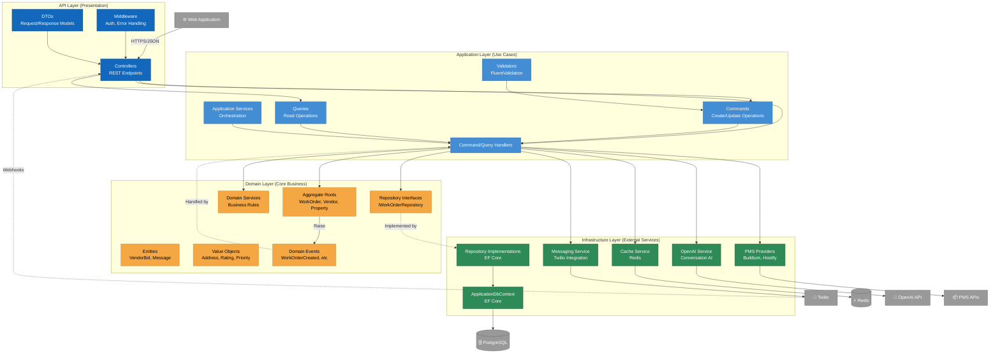
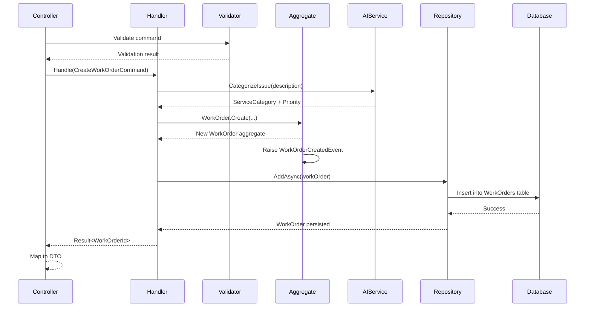

# DoorX - Component Diagram (C4 Level 3)

## Descripción

Diagrama de componentes mostrando la estructura interna del API Server, organizado según Clean Architecture y Domain-Driven Design.

**Nivel:** C4 Level 3 - Component Diagram
**Audiencia:** Desarrolladores, arquitectos técnicos
**Propósito:** Entender la organización interna del backend y las responsabilidades de cada componente

---

## Diagrama - API Server Components



---

## Componentes por Capa

### 🔷 API Layer (Presentation)

#### Controllers
**Responsabilidad:** Exponer endpoints REST y coordinar peticiones HTTP

```
WorkOrdersController
  ├── POST   /api/workorders              → CreateWorkOrder
  ├── GET    /api/workorders/{id}         → GetWorkOrder
  ├── GET    /api/workorders              → ListWorkOrders
  ├── PUT    /api/workorders/{id}/assign  → AssignVendor
  └── POST   /api/workorders/{id}/complete → CompleteWorkOrder

VendorsController
  ├── POST   /api/vendors                 → RegisterVendor
  ├── GET    /api/vendors                 → ListVendors
  └── GET    /api/vendors/{id}            → GetVendor

ConversationsController
  ├── POST   /api/conversations/message   → SendMessage
  └── GET    /api/conversations/{id}      → GetConversationHistory

WebhooksController
  └── POST   /webhooks/twilio/incoming    → HandleIncomingSMS
```

#### Middleware
- **AuthenticationMiddleware:** JWT token validation
- **ExceptionHandlingMiddleware:** Global error handling → Problem Details RFC 7807
- **RequestLoggingMiddleware:** Structured logging (Serilog)
- **RateLimitingMiddleware:** Rate limiting per user/API key

#### DTOs (Data Transfer Objects)
```csharp
CreateWorkOrderRequest
GetWorkOrderResponse
VendorBidDto
ConversationMessageDto
```

---

### 🔷 Application Layer (Use Cases)

#### Commands (Write Operations)
```csharp
CreateWorkOrderCommand
AssignVendorCommand
AddVendorBidCommand
CompleteWorkOrderCommand
SendMessageCommand
```

#### Queries (Read Operations)
```csharp
GetWorkOrderQuery
ListWorkOrdersQuery
GetAvailableVendorsQuery
GetConversationHistoryQuery
```

#### Handlers
**Patrón:** Command/Query Handler Pattern (CQRS)

```csharp
public class CreateWorkOrderCommandHandler : ICommandHandler<CreateWorkOrderCommand>
{
    private readonly IWorkOrderRepository _repository;
    private readonly IUnitOfWork _unitOfWork;
    private readonly IOpenAIService _aiService;

    public async Task<ErrorOr<WorkOrderId>> Handle(CreateWorkOrderCommand command)
    {
        // 1. Validate command (ya validado por Validator)
        // 2. Call AI to categorize issue
        var category = await _aiService.CategorizeIssue(command.Description);

        // 3. Create aggregate
        var workOrder = WorkOrder.Create(...);

        // 4. Persist
        await _repository.AddAsync(workOrder);
        await _unitOfWork.SaveChangesAsync();

        // 5. Return result
        return workOrder.Id;
    }
}
```

#### Validators
**FluentValidation** para validación de comandos y queries

```csharp
public class CreateWorkOrderCommandValidator : AbstractValidator<CreateWorkOrderCommand>
{
    public CreateWorkOrderCommandValidator()
    {
        RuleFor(x => x.Description)
            .NotEmpty()
            .MaximumLength(1000);

        RuleFor(x => x.TenantId)
            .NotEmpty();
    }
}
```

---

### 🔷 Domain Layer (Core Business)

#### Aggregate Roots
```
WorkOrder (Aggregate Root)
  ├── VendorBid (Entity)
  ├── WorkOrderId (Value Object)
  ├── ServiceCategory (Value Object)
  ├── Priority (Value Object)
  └── WorkOrderStatus (Value Object)

Vendor (Aggregate Root)
  ├── VendorId (Value Object)
  ├── Rating (Value Object)
  ├── ServiceArea (Value Object)
  └── Certifications (Collection)

Property (Aggregate Root)
  ├── PropertyId (Value Object)
  ├── Address (Value Object)
  └── PropertyType (Value Object)
```

#### Domain Events
```csharp
WorkOrderCreatedEvent
VendorAssignedEvent
WorkOrderCompletedEvent
VendorBidReceivedEvent
ConversationStartedEvent
```

#### Repository Interfaces (defined in Domain)
```csharp
public interface IWorkOrderRepository : IRepository<WorkOrder, WorkOrderId>
{
    Task<IEnumerable<WorkOrder>> GetByTenantAsync(TenantId tenantId);
    Task<IEnumerable<WorkOrder>> GetOpenWorkOrdersAsync();
    Task<WorkOrder?> GetWithBidsAsync(WorkOrderId id);
}
```

#### Domain Services
```csharp
VendorMatchingService
  └── FindBestVendors(ServiceCategory, Address, Rating) → List<Vendor>

PricingCalculationService
  └── CalculateEstimatedCost(ServiceCategory, Priority) → Money

WorkOrderLifecycleService
  └── CanTransitionTo(WorkOrderStatus from, WorkOrderStatus to) → bool
```

---

### 🔷 Infrastructure Layer (External Services)

#### Repository Implementations
```csharp
public class WorkOrderRepository : IWorkOrderRepository
{
    private readonly ApplicationDbContext _context;

    public async Task<WorkOrder?> GetByIdAsync(WorkOrderId id)
    {
        return await _context.WorkOrders
            .Include(w => w.Bids)
            .FirstOrDefaultAsync(w => w.Id == id);
    }
}
```

#### DbContext (Entity Framework Core)
```csharp
public class ApplicationDbContext : DbContext
{
    public DbSet<WorkOrder> WorkOrders { get; set; }
    public DbSet<Vendor> Vendors { get; set; }
    public DbSet<Property> Properties { get; set; }

    protected override void OnModelCreating(ModelBuilder modelBuilder)
    {
        modelBuilder.ApplyConfigurationsFromAssembly(Assembly.GetExecutingAssembly());
    }
}
```

#### PMS Providers (Factory Pattern)
```csharp
ITicketSystemProvider (Interface)
  ├── BuildiumProvider
  ├── HostifyProvider
  └── AppFolioProvider

TicketSystemProviderFactory
  └── GetProviderForProperty(PropertyId) → ITicketSystemProvider
```

#### OpenAI Service
```csharp
public interface IOpenAIService
{
    Task<ServiceCategory> CategorizeIssueAsync(string description);
    Task<string> GenerateResponseAsync(string message, ConversationContext context);
    Task<Priority> DeterminePriorityAsync(string description);
}
```

#### Messaging Service (Twilio)
```csharp
public interface IMessagingService
{
    Task SendSMSAsync(PhoneNumber to, string message);
    Task SendWhatsAppAsync(PhoneNumber to, string message);
}
```

---

## Flujo de Datos - Ejemplo: Crear Work Order



---

## Principios Aplicados

### Dependency Rule (Clean Architecture)
```
API → Application → Domain ← Infrastructure
```
- Domain no depende de nadie
- Infrastructure depende de Domain (implementa interfaces)
- Application depende de Domain
- API depende de Application + Infrastructure (composition root)

### SOLID Principles

#### Single Responsibility Principle (SRP)
- Cada handler tiene una sola responsabilidad
- Controllers solo coordinan, no contienen lógica de negocio

#### Open/Closed Principle (OCP)
- PMS Providers extensibles sin modificar código existente
- Nuevos handlers se agregan sin modificar infrastructure

#### Liskov Substitution Principle (LSP)
- Todos los `ITicketSystemProvider` son intercambiables

#### Interface Segregation Principle (ISP)
- Interfaces específicas por aggregate (`IWorkOrderRepository`, no un `IRepository` genérico gigante)

#### Dependency Inversion Principle (DIP)
- Application depende de `IWorkOrderRepository` (abstracción), no de `WorkOrderRepository` (implementación)

---

## Patrones Implementados

| Patrón | Ubicación | Propósito |
|--------|-----------|-----------|
| **CQRS** | Application Layer | Separar reads/writes |
| **Repository** | Domain/Infrastructure | Abstraer persistencia |
| **Unit of Work** | Infrastructure | Transacciones atómicas |
| **Factory** | Infrastructure | Crear PMS providers dinámicamente |
| **Adapter** | Infrastructure | Adaptar APIs externas |
| **Domain Events** | Domain | Desacoplar efectos secundarios |
| **Aggregate** | Domain | Garantizar consistencia |
| **Value Object** | Domain | Inmutabilidad y validación |

---

## Siguiente Nivel

📍 **Estás aquí:** C4 Level 3 - Component Diagram
📖 **Anterior:** [02-container-diagram.md](./02-container-diagram.md)
📖 **Siguiente:** [04-code-diagram.md](./04-code-diagram.md) - Diagramas de clases (opcional)

---

## Referencias

- [Clean Architecture - Uncle Bob](https://blog.cleancoder.com/uncle-bob/2012/08/13/the-clean-architecture.html)
- [DDD Reference - Eric Evans](https://www.domainlanguage.com/ddd/reference/)
- [CQRS Pattern](https://martinfowler.com/bliki/CQRS.html)
- [DoorX Domain Model](../../DOMAIN_MODEL.md)
