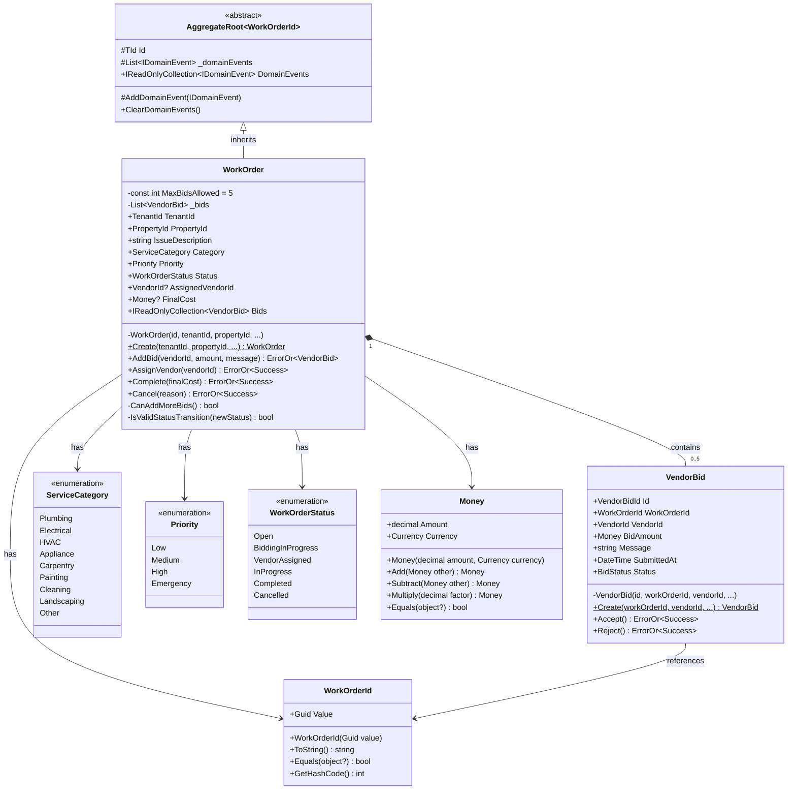
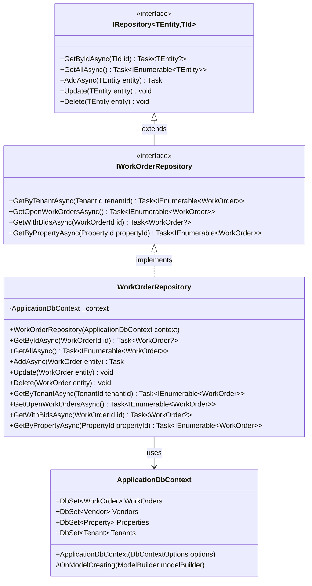
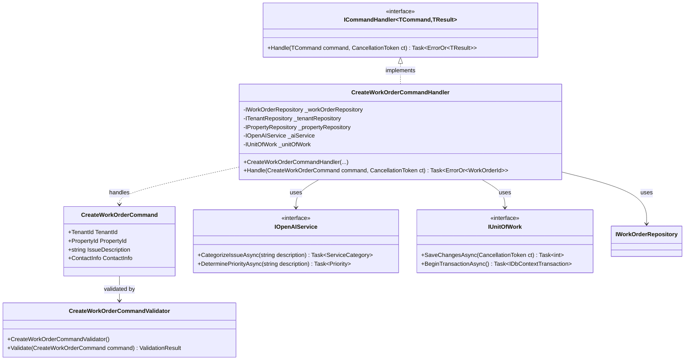
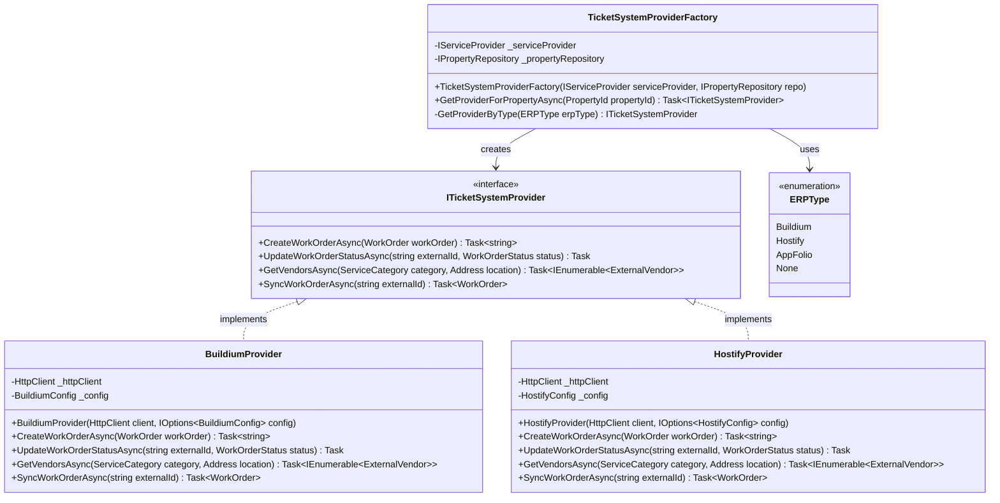
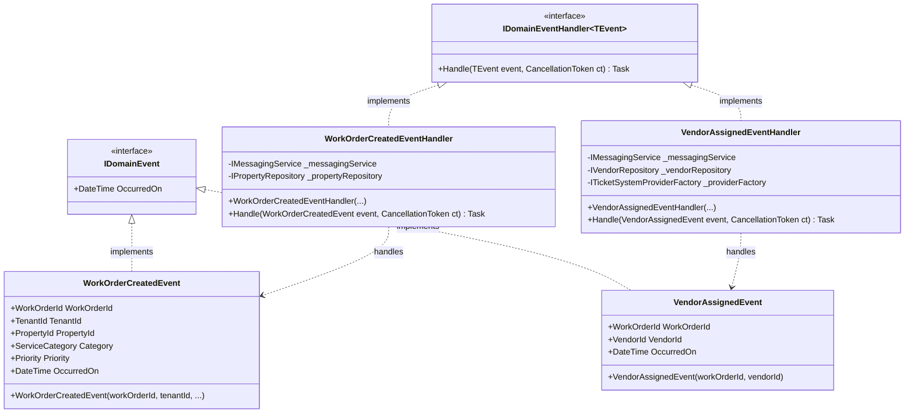
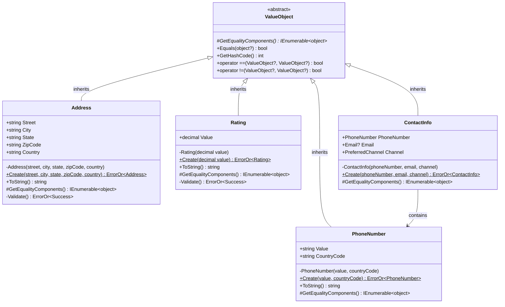

# DoorX - Code Diagram (C4 Level 4)

## Descripción

Diagramas de clases mostrando la implementación detallada de componentes críticos del sistema. Este nivel es opcional y se usa para documentar partes complejas o críticas.

**Nivel:** C4 Level 4 - Code/Class Diagrams
**Audiencia:** Desarrolladores trabajando en el código
**Propósito:** Documentar la implementación específica de componentes complejos

---

## WorkOrder Aggregate - Class Diagram



---

## Repository Pattern - Interface & Implementation



---

## CQRS - Command Handler Pattern



---

## Factory Pattern - PMS Provider Selection



---

## Domain Events - Publisher/Subscriber



---

## Value Objects - Immutability & Validation



---

## Notas de Implementación

### Aggregate Design Principles

1. **Constructor privado + Factory method estático**
   ```csharp
   private WorkOrder(...) { }
   public static WorkOrder Create(...) { }
   ```

2. **Colecciones privadas con exposición de solo lectura**
   ```csharp
   private readonly List<VendorBid> _bids = new();
   public IReadOnlyCollection<VendorBid> Bids => _bids.AsReadOnly();
   ```

3. **Validación en el aggregate**
   ```csharp
   private bool CanAddMoreBids() => _bids.Count < MaxBidsAllowed;
   ```

### Repository Pattern

- **Interfaces en Domain layer** (Dependency Inversion)
- **Implementaciones en Infrastructure layer**
- Operaciones específicas del agregado (`GetWithBidsAsync`)

### CQRS Benefits

- **Separación de concerns:** Reads vs Writes
- **Optimización independiente:** Different models for queries
- **Escalabilidad:** Read replicas para queries

### Factory Pattern for PMS

- **Runtime selection** basado en configuración de Property
- **Extensible:** Nuevos providers sin modificar código existente
- **Testeable:** Mock del provider en tests

---

## Convenciones de Código

### Naming Conventions

- **Aggregates:** PascalCase singular (WorkOrder, Vendor)
- **Value Objects:** PascalCase descriptivo (ServiceCategory, Priority)
- **Commands:** Verb + Noun + "Command" (CreateWorkOrderCommand)
- **Handlers:** Command/Query + "Handler" (CreateWorkOrderCommandHandler)
- **Events:** Past tense + "Event" (WorkOrderCreatedEvent)

### ErrorOr Pattern

```csharp
// Return type
public ErrorOr<WorkOrder> CreateWorkOrder(...)

// Success case
return workOrder;

// Error case
return Error.Validation("WorkOrder.MaxBids", "Maximum bids reached");

// Consuming
result.Match(
    success => Ok(success),
    errors => Problem(errors)
);
```

---

## Referencias

- [Clean Architecture Code Example](https://github.com/jasontaylordev/CleanArchitecture)
- [DDD Aggregates](https://martinfowler.com/bliki/DDD_Aggregate.html)
- [Value Objects](https://martinfowler.com/bliki/ValueObject.html)
- [ErrorOr Library](https://github.com/amantinband/error-or)
- [DoorX Domain Model](../../DOMAIN_MODEL.md)

---

📍 **Estás aquí:** C4 Level 4 - Code Diagram
📖 **Anterior:** [03-component-diagram.md](./03-component-diagram.md)
