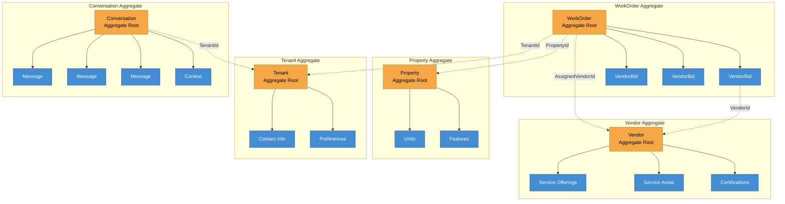
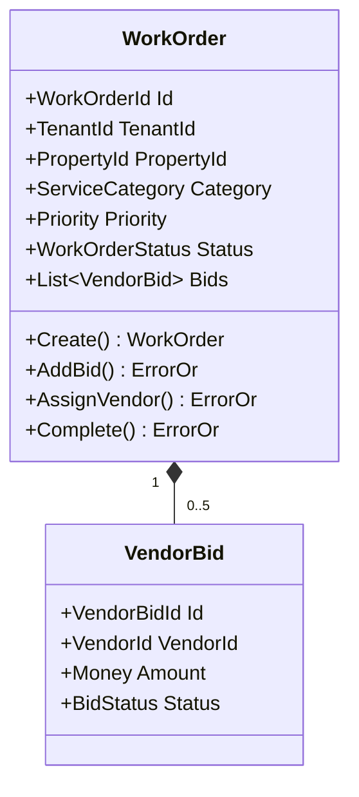

# DoorX - Aggregates Design

## Descripción

Diagrama de los principales Aggregate Roots del sistema DoorX y sus entidades internas.

---

## Main Aggregates

---

## Aggregate Details

### WorkOrder Aggregate

**Invariants:**
- Maximum 5 bids per work order
- Cannot add bids after vendor assigned
- Status transitions must be valid

---

## Referencias

- [DDD Aggregates](https://martinfowler.com/bliki/DDD_Aggregate.html)
- [Effective Aggregate Design](https://www.dddcommunity.org/library/vernon_2011/)
