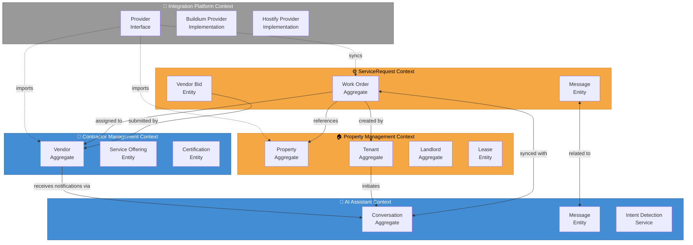
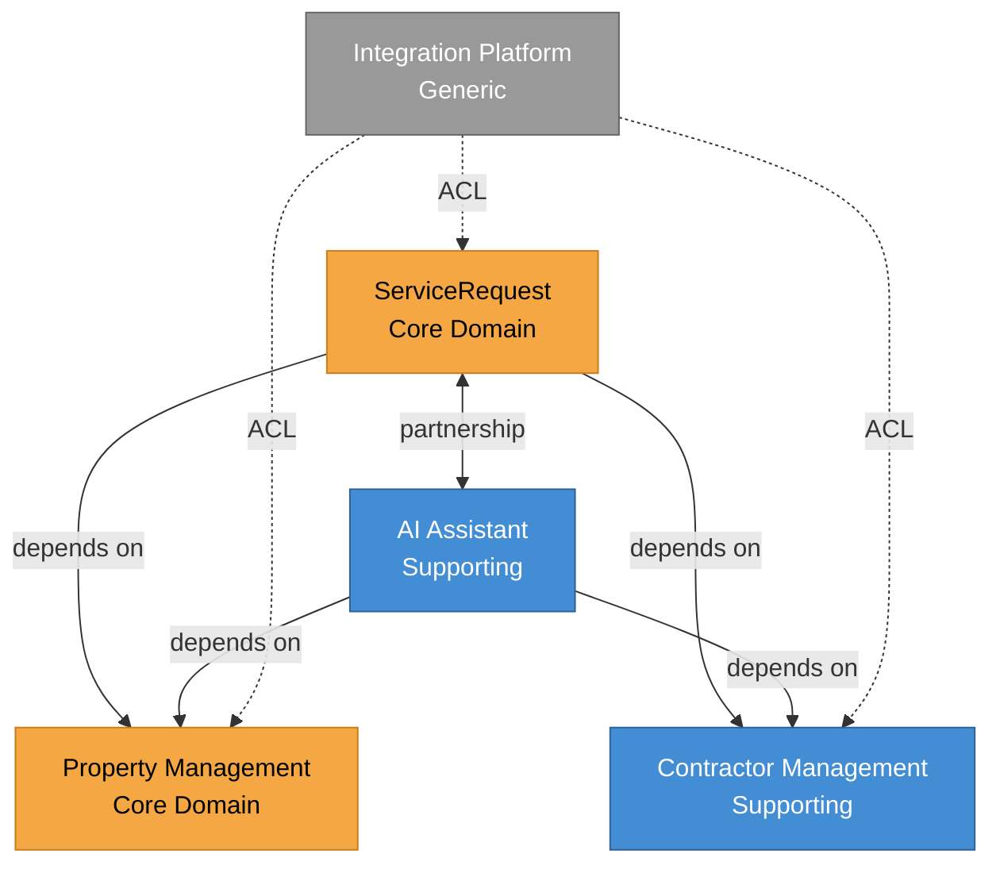

# DoorX - Bounded Contexts Map

## Descripción

Mapa de Bounded Contexts del sistema DoorX mostrando los contextos delimitados, sus responsabilidades y las relaciones entre ellos según Domain-Driven Design.

---

## Context Map



---

## Bounded Contexts Overview

### 1️⃣ ServiceRequest Context (Core Domain)

**Propósito:** Gestionar el ciclo de vida completo de solicitudes de mantenimiento

**Aggregate Roots:**
- `WorkOrder` - Solicitud de mantenimiento principal

**Entidades:**
- `VendorBid` - Oferta de un contratista
- `Message` - Mensajes relacionados al work order

**Value Objects:**
- `WorkOrderId`, `ServiceCategory`, `Priority`, `WorkOrderStatus`

**Domain Events:**
- `WorkOrderCreated`
- `VendorAssigned`
- `WorkOrderCompleted`
- `VendorBidReceived`

**Responsabilidades:**
- Crear y gestionar work orders
- Recolectar ofertas de vendors
- Asignar vendors a work orders
- Transiciones de estado del ciclo de vida
- Calcular costos estimados

---

### 2️⃣ Property Management Context (Core Domain)

**Propósito:** Administrar propiedades, propietarios e inquilinos

**Aggregate Roots:**
- `Property` - Propiedad física
- `Tenant` - Inquilino
- `Landlord` - Propietario

**Entidades:**
- `Lease` - Contrato de arrendamiento
- `Unit` - Unidad dentro de una propiedad (apartments, rooms)

**Value Objects:**
- `PropertyId`, `TenantId`, `LandlordId`, `Address`, `PropertyType`

**Domain Events:**
- `PropertyCreated`
- `TenantAssignedToProperty`
- `LeaseExpired`

**Responsabilidades:**
- Registro de propiedades
- Gestión de inquilinos
- Asignación de inquilinos a propiedades
- Configuración de PMS externo por propiedad
- Control de ocupación

---

### 3️⃣ Contractor Management Context (Supporting Domain)

**Propósito:** Gestionar contratistas y sus capacidades

**Aggregate Roots:**
- `Vendor` - Contratista/proveedor de servicios

**Entidades:**
- `ServiceOffering` - Tipos de servicio ofrecidos
- `ServiceArea` - Áreas de cobertura geográfica
- `Certification` - Licencias, seguros, certificaciones

**Value Objects:**
- `VendorId`, `Rating`, `ServiceType`

**Domain Events:**
- `VendorRegistered`
- `VendorRatingUpdated`
- `CertificationExpired`

**Responsabilidades:**
- Registro de vendors
- Matching de vendors por servicio/ubicación
- Sistema de calificaciones
- Gestión de certificaciones
- Integración con vendors de PMS externos

---

### 4️⃣ AI Assistant Context (Supporting Domain)

**Propósito:** Orquestar conversaciones inteligentes con IA

**Aggregate Roots:**
- `Conversation` - Sesión de chat

**Entidades:**
- `ConversationMessage` - Mensaje individual
- `ConversationContext` - Contexto y memoria

**Value Objects:**
- `ConversationId`, `MessageId`, `SenderType`, `Channel`

**Domain Events:**
- `ConversationStarted`
- `MessageReceived`
- `IntentDetected`

**Servicios de Dominio:**
- `IntentDetectionService` - Detectar intención del usuario
- `ContextManagementService` - Mantener contexto conversacional

**Responsabilidades:**
- Gestionar sesiones de chat
- Detectar intenciones (crear WO, consultar estado, etc.)
- Mantener contexto conversacional
- Coordinar entre múltiples partes (tenant, vendor, PM)
- Escalar a humanos cuando necesario

---

### 5️⃣ Integration Platform Context (Generic Subdomain)

**Propósito:** Conectar con sistemas externos (PMS)

**Interfaces:**
- `ITicketSystemProvider` - Interface común para todos los PMS

**Implementaciones:**
- `BuildiumProvider`
- `HostifyProvider`
- `AppFolioProvider`

**Value Objects:**
- `ExternalWorkOrderId`
- `ERPType`

**Responsabilidades:**
- Patrón Adapter para cada PMS
- Sincronización bidireccional de work orders
- Importación de vendors y propiedades
- Transformación de datos entre formatos
- Manejo de webhooks de PMS externos

---

## Context Mapping Patterns

### Customer/Supplier

**ServiceRequest → PropertyManagement**
- ServiceRequest es **Customer** (downstream)
- PropertyManagement es **Supplier** (upstream)
- WorkOrder referencia Property y Tenant (IDs solamente)

**ServiceRequest → ContractorManagement**
- ServiceRequest es **Customer**
- ContractorManagement es **Supplier**
- WorkOrder referencia Vendor (ID solamente)

### Partnership

**ServiceRequest ↔ AIAssistant**
- Colaboración bidireccional estrecha
- Conversation puede crear WorkOrders
- WorkOrders pueden iniciar Conversations
- Modelo compartido: Message

### Anticorruption Layer (ACL)

**IntegrationPlatform → ServiceRequest**
- IntegrationPlatform traduce modelos externos a modelos internos
- Protege el dominio core de cambios en APIs externas
- Factory pattern para seleccionar provider correcto

**IntegrationPlatform → PropertyManagement**
- Importa propiedades desde PMS externos
- Traduce formatos de dirección, tipos de propiedad

---

## Shared Kernel

### Common Value Objects (Compartidos)

Estos Value Objects se usan en múltiples contextos:

```
Common/
├── ContactInfo (email, phone)
├── Address (street, city, state, zip)
├── Language (en, es, fr)
└── Money (amount, currency)
```

**Regla:** Cambios en Shared Kernel requieren coordinación entre equipos.

---

## Diagrama de Dependencias



---

## Strategic Design Decisions

### ¿Por qué separar ServiceRequest y PropertyManagement?

**Razones:**
1. **Diferentes frecuencias de cambio:** Properties cambian raramente, WorkOrders cambian constantemente
2. **Diferentes owners:** Property Management puede ser gestionado por diferentes equipos
3. **Escalabilidad independiente:** WorkOrders tienen mayor volumen de operaciones
4. **Reutilización:** PropertyManagement puede usarse en otros contextos (billing, reporting)

### ¿Por qué AIAssistant es un contexto separado?

**Razones:**
1. **Tecnología diferente:** IA/ML tiene diferentes patrones y herramientas
2. **Evolución independiente:** Modelos de IA mejoran continuamente
3. **Multicanal:** Maneja SMS, WhatsApp, Web chat
4. **Reutilización:** Puede usarse para otras conversaciones (soporte, sales)

### ¿Por qué Integration Platform es Generic Subdomain?

**Razones:**
1. **No es core business:** Es infraestructura técnica
2. **Patrón repetitivo:** Todos los adapters siguen el mismo patrón
3. **Commodity:** Podría reemplazarse por solución de terceros (Zapier, n8n)

---

## Team Organization (Conway's Law)

Idealmente, cada Bounded Context debería tener un equipo dedicado:

```
Team A: ServiceRequest + PropertyManagement (Core)
Team B: ContractorManagement (Supporting)
Team C: AIAssistant (Supporting)
Team D: IntegrationPlatform (Generic - puede ser shared)
```

Para equipos pequeños (startup):
```
Team 1: Core Domains (ServiceRequest + PropertyManagement)
Team 2: Supporting Domains (ContractorManagement + AIAssistant + Integration)
```

---

## Context Boundaries - Communication Protocols

| From Context | To Context | Protocol | Notes |
|--------------|------------|----------|-------|
| ServiceRequest | PropertyManagement | In-Memory (same process) | ID references only |
| ServiceRequest | ContractorManagement | In-Memory | ID references only |
| ServiceRequest | AIAssistant | Domain Events | Async communication |
| AIAssistant | ServiceRequest | Commands | Create WorkOrder command |
| IntegrationPlatform | ServiceRequest | REST API calls | Via repositories |
| Web App | Any Context | REST API | Through controllers |

---

## Evolution Strategy

### Phase 1 (Current - Monolith)
Todos los contextos en un mismo proceso (ASP.NET Core app).

### Phase 2 (Future - Modular Monolith)
Contextos separados en diferentes proyectos/namespaces, pero mismo deployment.

### Phase 3 (Future - Microservices)
Contextos separados en servicios independientes:
- ServiceRequest Service
- PropertyManagement Service
- ContractorManagement Service
- AIAssistant Service
- IntegrationPlatform Service

---

## Referencias

- [DDD Reference - Bounded Contexts](https://www.domainlanguage.com/ddd/reference/)
- [Context Mapping Patterns](https://github.com/ddd-crew/context-mapping)
- [Strategic Design with Context Mapping](https://www.infoq.com/articles/ddd-contextmapping/)
- [DoorX Domain Model](../../DOMAIN_MODEL.md)
- [DoorX Ubiquitous Language](../../UBIQUITOUS_LANGUAGE.md)
