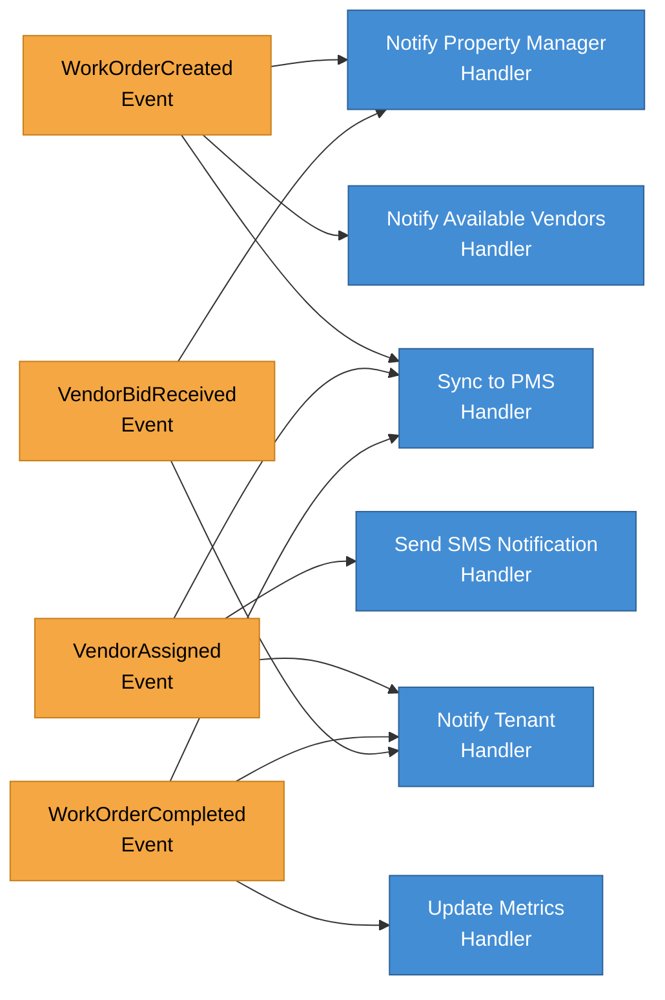

# DoorX - Domain Events Flow

## Descripción

Diagrama de Domain Events y sus handlers en el sistema DoorX.

---

## Domain Events Flow

---

## Event Catalog

### WorkOrderCreated
**Raised when:** A new work order is created
**Handlers:**
- Notify Property Manager
- Find and notify available vendors
- Sync to external PMS

### VendorAssigned
**Raised when:** A vendor is assigned to a work order
**Handlers:**
- Send SMS to vendor
- Notify tenant
- Update PMS

### WorkOrderCompleted
**Raised when:** Work is completed
**Handlers:**
- Notify tenant for confirmation
- Update analytics/metrics
- Close work order in PMS

---

## Referencias

- [Domain Events](https://martinfowler.com/eaaDev/DomainEvent.html)
- [DoorX Business Rules](../../BUSINESS_RULES.md)
