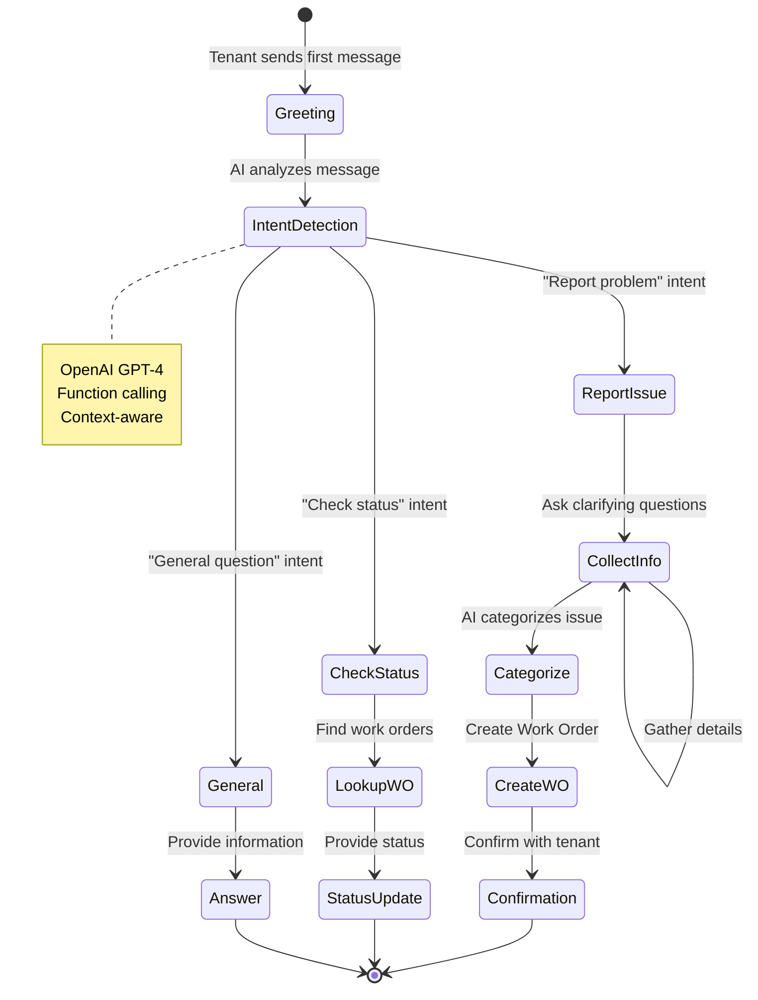
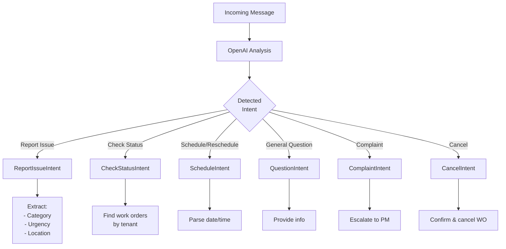
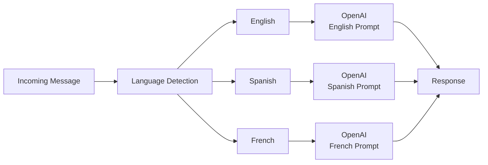

# DoorX - AI Conversation Flow (Aimee)

## Descripción

Flujo de conversación con el asistente de IA (Aimee) para crear y gestionar work orders a través de mensajes naturales.

---

## Conversation Flow



---

## Example Conversation Flow

```mermaid
sequenceDiagram
    participant T as Tenant<br/>(SMS)
    participant AI as Aimee<br/>(AI Assistant)
    participant SYS as DoorX System
    participant OpenAI as OpenAI GPT-4

    T->>AI: "My AC is broken"

    AI->>OpenAI: Analyze intent + extract entities
    OpenAI-->>AI: Intent: ReportIssue<br/>Category: HVAC<br/>Urgency: High

    AI->>T: "I understand your AC isn't working.<br/>Is it not turning on at all, or<br/>is it running but not cooling?"

    T->>AI: "It's running but blowing hot air"

    AI->>OpenAI: Additional context
    OpenAI-->>AI: Priority: High<br/>Issue: Refrigerant leak likely

    AI->>T: "Got it. This sounds urgent.<br/>When did you first notice this?"

    T->>AI: "This morning"

    AI->>SYS: Create WorkOrder<br/>(Category: HVAC, Priority: High)
    SYS-->>AI: WorkOrder #12345 created

    AI->>T: "I've created Work Order #12345.<br/>I'm finding available HVAC technicians<br/>in your area now..."

    SYS->>SYS: Find vendors, request bids

    AI->>T: "Found 3 qualified technicians.<br/>ABC HVAC can come tomorrow at 2 PM<br/>for $200. Does that work?"

    T->>AI: "Yes, that's perfect"

    AI->>SYS: Assign vendor
    SYS-->>AI: Vendor assigned

    AI->>T: "✅ Confirmed! ABC HVAC will visit<br/>tomorrow at 2 PM. You'll receive<br/>a reminder 1 hour before.<br/><br/>Work Order #12345"
```



---

## Intent Classification



---

## Context Management

Aimee maintains conversation context across messages:

```json
{
  "conversationId": "conv_123",
  "tenantId": "tenant_456",
  "channel": "SMS",
  "phoneNumber": "+15551234567",
  "context": {
    "currentIntent": "ReportIssue",
    "workOrderDraft": {
      "category": "HVAC",
      "priority": "High",
      "description": "AC running but blowing hot air",
      "startedAt": "2024-01-15T08:30:00Z"
    },
    "collectedInfo": [
      "issue_type",
      "urgency",
      "description"
    ],
    "pendingInfo": [
      "availability"
    ]
  },
  "messages": [
    {"role": "user", "content": "My AC is broken"},
    {"role": "assistant", "content": "Is it not turning on..."},
    {"role": "user", "content": "Running but blowing hot air"}
  ]
}
```

---

## Multi-Channel Support

```mermaid
graph TB
    subgraph Channels
        SMS[📱 SMS<br/>Twilio]
        WhatsApp[💬 WhatsApp<br/>Twilio]
        Web[🌐 Web Chat<br/>WebSocket]
        Email[📧 Email<br/>Future]
    end

    SMS --> Gateway[Message Gateway]
    WhatsApp --> Gateway
    Web --> Gateway
    Email --> Gateway

    Gateway --> AI[Aimee AI Engine]
    AI --> Conversation[Conversation Manager]
    Conversation --> Context[Context Store<br/>Redis]

    AI --> Response[Generate Response]
    Response --> Gateway
    Gateway --> SMS
    Gateway --> WhatsApp
    Gateway --> Web
```



---

## AI Function Calling

OpenAI can call these functions directly:

```typescript
functions: [
  {
    name: "create_work_order",
    description: "Create a new maintenance work order",
    parameters: {
      category: "HVAC" | "Plumbing" | "Electrical" | ...,
      priority: "Low" | "Medium" | "High" | "Emergency",
      description: string,
      preferredDate?: string
    }
  },
  {
    name: "check_work_order_status",
    description: "Get status of existing work order",
    parameters: {
      workOrderId?: string
    }
  },
  {
    name: "find_available_vendors",
    description: "Find vendors for a service category",
    parameters: {
      category: string,
      urgency: string
    }
  },
  {
    name: "schedule_appointment",
    description: "Schedule or reschedule appointment",
    parameters: {
      workOrderId: string,
      dateTime: string
    }
  },
  {
    name: "escalate_to_human",
    description: "Escalate conversation to human agent",
    parameters: {
      reason: string
    }
  }
]
```

---

## Escalation Rules

Aimee escalates to human if:

1. **Complex/Ambiguous Issues**
   - AI confidence < 70%
   - Multiple intents detected
   - Unclear category

2. **Sensitive Situations**
   - Tenant complaint
   - Legal/safety concerns
   - Dispute with vendor

3. **Technical Limitations**
   - Requires inspection before diagnosis
   - Emergency but no vendors available
   - Cost > $1000

4. **User Request**
   - Tenant explicitly asks for human
   - Conversation going in circles (>5 back-and-forth)

---

## Conversation Metrics

Track these metrics for improvement:

| Metric | Target | Current |
|--------|--------|---------|
| Intent accuracy | >90% | 87% |
| First contact resolution | >70% | 65% |
| Avg messages to WO creation | <5 | 4.2 |
| Escalation rate | <15% | 18% |
| Tenant satisfaction | >4.5/5 | 4.3/5 |

---

## Multi-Language Support



Supported languages:
- 🇺🇸 English (primary)
- 🇪🇸 Spanish
- 🇫🇷 French (future)

---

## Referencias

- [OpenAI Assistants API](https://platform.openai.com/docs/assistants/overview)
- [Conversation Entity](../../../src/Domain/Conversations/Entities/Conversation.cs)
- [DoorX AI Architecture](../../ARCHITECTURE.md#ai-assistant)
