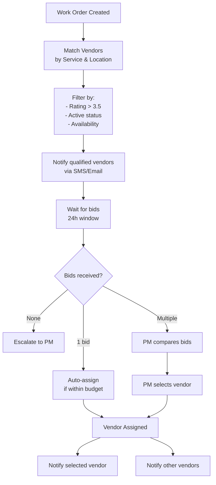
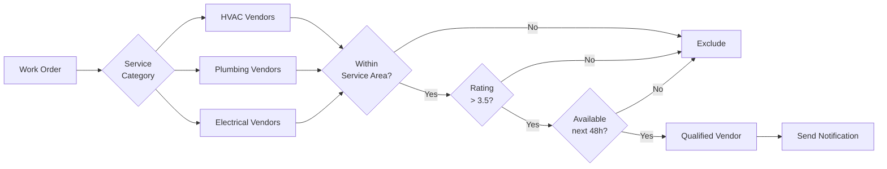
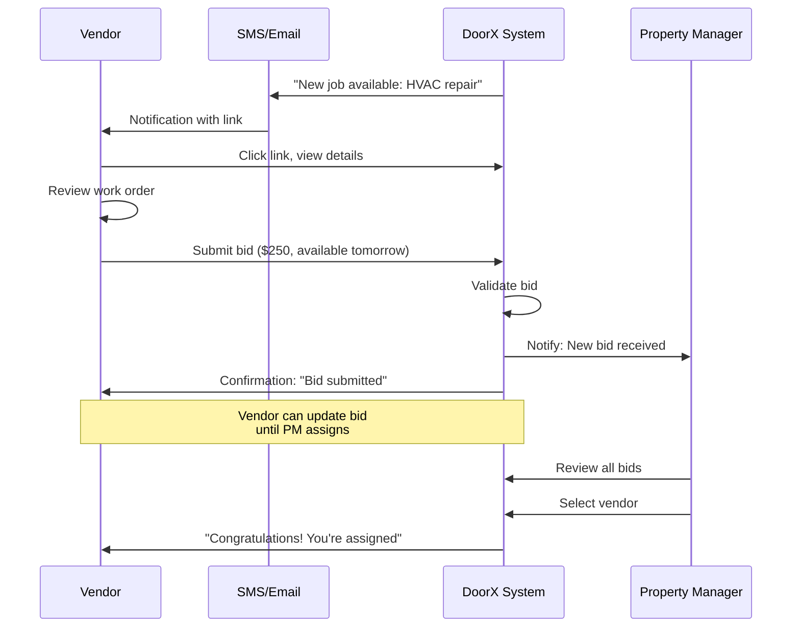

# DoorX - Vendor Bidding Process

## Descripción

Proceso detallado de cómo los vendors reciben notificaciones, envían ofertas y son asignados a work orders.

---

## Bidding Process Overview



---

## Vendor Matching Algorithm



---

## Bid Submission Flow



---

## Bid Comparison Matrix

| Vendor | Rating | Bid Amount | Availability | Distance | Score |
|--------|--------|------------|--------------|----------|-------|
| ABC HVAC | 4.8 | $200 | Tomorrow 2 PM | 2.5 mi | 95 |
| XYZ Cooling | 4.5 | $180 | 2 days | 8 mi | 85 |
| Fast Fix | 4.0 | $250 | Today 6 PM | 5 mi | 78 |

**Scoring Formula:**
```
Score = (Rating × 20) + (100 - Normalized_Price × 30) + (100 - Distance_Score × 20) + Availability_Bonus
```

---

## Notification Templates

### Initial Notification (SMS)
```
🔧 New Job Available!

Service: HVAC Repair
Location: 123 Main St, Austin, TX
Priority: High
Estimated: $150-$250

Submit bid: https://doorx.com/bid/12345
Expires: 24 hours
```

### Bid Accepted
```
✅ Congratulations!

You've been assigned to Work Order #12345
Tenant: John Doe
Address: 123 Main St
Phone: (555) 123-4567
Scheduled: Tomorrow at 2 PM

View details: https://doorx.com/wo/12345
```

### Bid Rejected
```
Thank you for your bid on Work Order #12345.
Another vendor was selected for this job.

We'll notify you of future opportunities.
```

---

## Auto-Assignment Criteria

Work order is **auto-assigned** if:
1. Only 1 qualified vendor available
2. Bid amount < $100 (low risk)
3. Vendor rating ≥ 4.5
4. Vendor has completed 10+ jobs successfully

Otherwise, PM reviews and approves.

---

## Referencias

- [Vendor Entity](../../../src/Domain/Vendors/Entities/Vendor.cs)
- [VendorBid Entity](../../../src/Domain/WorkOrders/Entities/VendorBid.cs)
