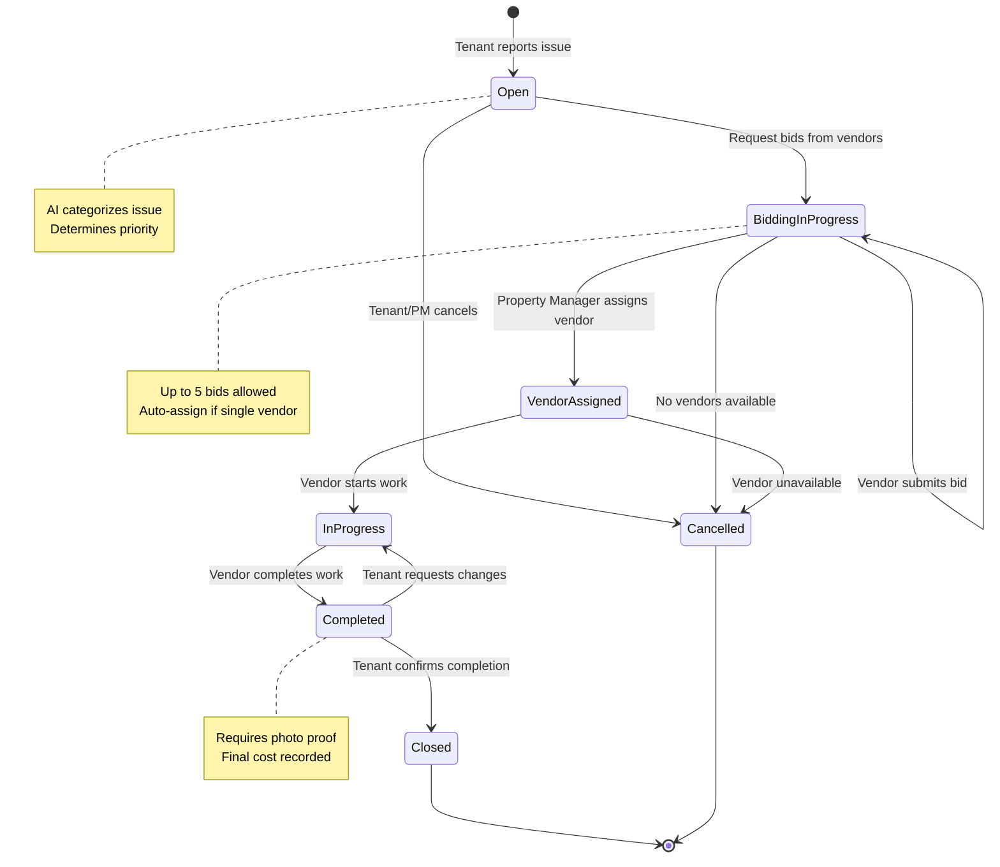
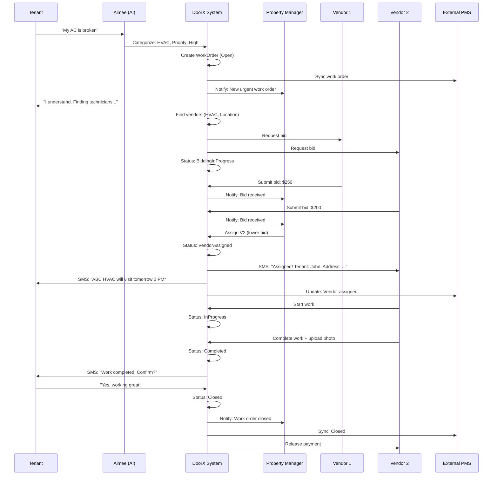
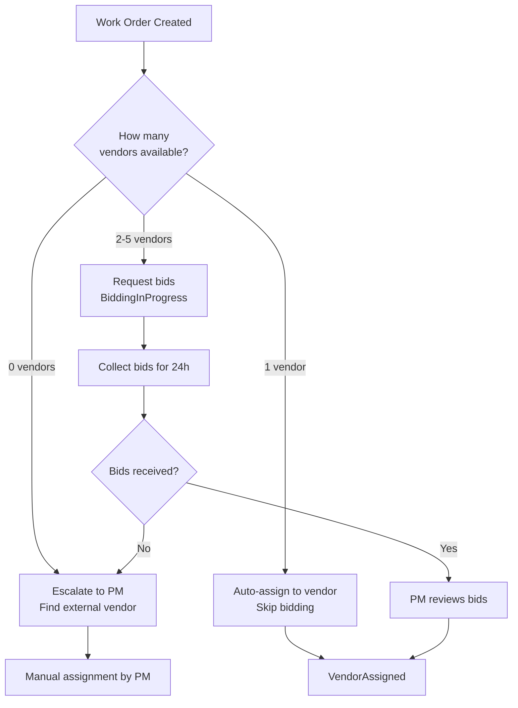
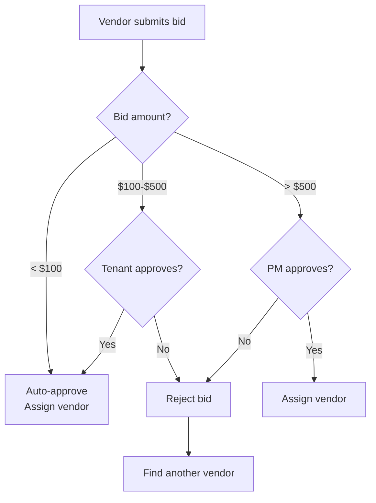

# DoorX - Work Order Lifecycle Flow

## Descripción

Flujo completo del ciclo de vida de un Work Order desde su creación hasta su cierre.

---

## Complete Lifecycle

---

## Detailed Flow with Actors

---

## State Transition Rules

| Current Status | Valid Next States | Trigger |
|----------------|-------------------|---------|
| Open | BiddingInProgress, Cancelled | Request bids or cancel |
| BiddingInProgress | VendorAssigned, Cancelled | Assign vendor or no vendors |
| VendorAssigned | InProgress, Cancelled | Vendor starts or cancels |
| InProgress | Completed, Cancelled | Work done or issue |
| Completed | Closed, InProgress | Tenant confirms or rejects |
| Closed | - | Terminal state |
| Cancelled | - | Terminal state |

---

## Auto-Assignment Logic

---

## Priority-Based SLA

| Priority | Response Time | Resolution Time | Auto-Escalation |
|----------|---------------|-----------------|-----------------|
| Emergency | 1 hour | 4 hours | 30 min if no vendor |
| High | 4 hours | 24 hours | 2 hours if no vendor |
| Medium | 24 hours | 3 days | Next business day |
| Low | 3 days | 7 days | After 5 days |

---

## Cost Approval Rules

---

## Referencias

- [DoorX Business Rules](../../BUSINESS_RULES.md)
- [Work Order Entity](../../../src/Domain/WorkOrders/Entities/WorkOrder.cs)
