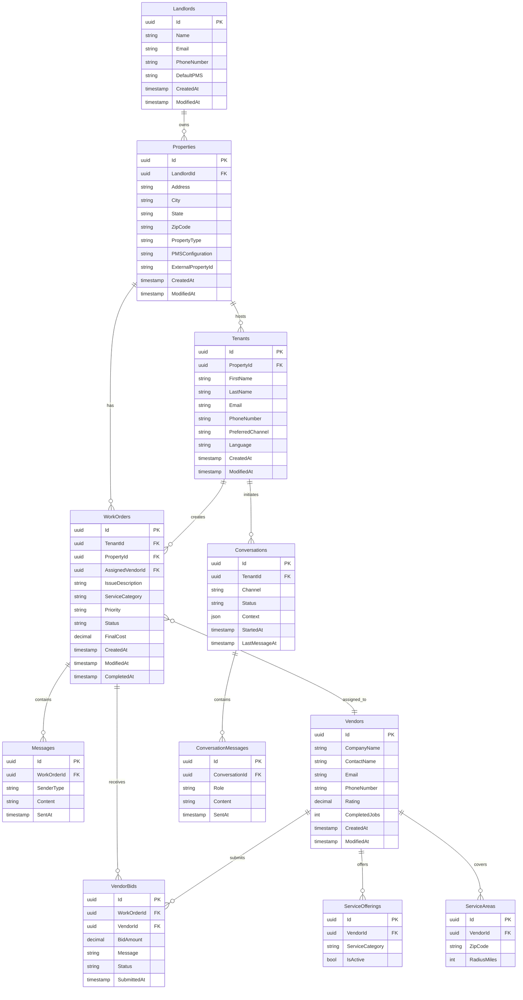

# DoorX - Database Schema

## Descripción

Esquema relacional de la base de datos PostgreSQL.

---

## Entity Relationship Diagram

---

## Key Tables

### WorkOrders
Primary aggregate for maintenance requests
- Indexes: `TenantId`, `PropertyId`, `Status`, `CreatedAt`
- Full-text search: `IssueDescription`

### Vendors
Contractor information and ratings
- Indexes: `Rating`, `CompletedJobs`
- Composite: `(ServiceCategory, ZipCode)` for matching

### Conversations
AI chat sessions with context
- JSONB column for flexible context storage
- Index on `TenantId`, `Status`

---

## Referencias

- [Domain Model](../../DOMAIN_MODEL.md)
- [Entity Configurations](../../../src/Infrastructure/Persistence/Configurations/)
