# DoorX - Deployment Diagram

## Descripción

Diagrama de deployment mostrando la infraestructura de producción en la nube.

---

## Production Deployment (Azure)

```mermaid
graph TB
    subgraph Internet
        Users[👥 Users<br/>Web/Mobile]
        Vendors[👷 Vendors<br/>SMS/Web]
        Twilio[📱 Twilio<br/>SMS/WhatsApp]
    end

    subgraph Azure["Azure Cloud"]
        subgraph FrontDoor["Azure Front Door<br/>(CDN + WAF)"]
            CDN[Content Delivery]
            WAF[Web Application Firewall]
        end

        subgraph AppServices["App Service Plan<br/>(Premium V3)"]
            API1[API Instance 1<br/>ASP.NET Core]
            API2[API Instance 2<br/>ASP.NET Core]
            API3[API Instance 3<br/>ASP.NET Core]
        end

        subgraph StaticWebApp["Static Web App"]
            Angular[Angular SPA<br/>Frontend]
        end

        subgraph Data["Data Services"]
            PostgreSQL[(Azure Database<br/>for PostgreSQL<br/>Flexible Server)]
            Redis[(Azure Cache<br/>for Redis<br/>Premium)]
            Blob[Azure Blob Storage<br/>Documents/Photos]
        end

        subgraph Monitoring["Monitoring"]
            AppInsights[Application Insights<br/>Telemetry]
            LogAnalytics[Log Analytics<br/>Workspace]
        end

        subgraph KeyVault["Security"]
            KV[Azure Key Vault<br/>Secrets/Certificates]
        end
    end

    subgraph External["External Services"]
        OpenAI[OpenAI API<br/>GPT-4]
        BuildiumAPI[Buildium API]
        HostifyAPI[Hostify API]
    end

    %% User connections
    Users --> CDN
    Vendors --> CDN

    %% Front Door routing
    CDN --> Angular
    CDN --> WAF
    WAF --> API1
    WAF --> API2
    WAF --> API3

    %% Twilio webhooks
    Twilio -.->|Webhooks| WAF

    %% API to Data
    API1 --> PostgreSQL
    API2 --> PostgreSQL
    API3 --> PostgreSQL
    API1 --> Redis
    API2 --> Redis
    API3 --> Redis
    API1 --> Blob
    API2 --> Blob
    API3 --> Blob

    %% API to External
    API1 --> OpenAI
    API2 --> OpenAI
    API3 --> OpenAI
    API1 --> Twilio
    API1 --> BuildiumAPI
    API1 --> HostifyAPI

    %% Monitoring
    API1 --> AppInsights
    API2 --> AppInsights
    API3 --> AppInsights
    Angular --> AppInsights
    AppInsights --> LogAnalytics

    %% Secrets
    API1 --> KV
    API2 --> KV
    API3 --> KV

    classDef azure fill:#0078D4,stroke:#005A9E,color:#ffffff
    classDef data fill:#50E6FF,stroke:#00B7C3,color:#000000
    classDef external fill:#999999,stroke:#666666,color:#ffffff

    class FrontDoor,AppServices,StaticWebApp,Monitoring,KeyVault azure
    class Data,PostgreSQL,Redis,Blob data
    class OpenAI,BuildiumAPI,HostifyAPI,Twilio external
```



---

## Infrastructure Components

### Compute

| Service | Tier | Instance | Purpose |
|---------|------|----------|---------|
| App Service Plan | Premium V3 P2v3 | 3 instances | API hosting (auto-scale 2-5) |
| Static Web Apps | Standard | - | Angular frontend |

### Data & Storage

| Service | Tier | Configuration |
|---------|------|---------------|
| Azure Database for PostgreSQL | Flexible Server (D4s_v3) | 4 vCores, 16 GB RAM, 256 GB storage |
| Azure Cache for Redis | Premium P1 | 6 GB cache, persistence enabled |
| Azure Blob Storage | Hot tier | Documents, photos, backups |

### Networking & Security

| Service | Purpose |
|---------|---------|
| Azure Front Door | Global load balancing, CDN, WAF |
| Azure Key Vault | Secrets, connection strings, certificates |
| Virtual Network | Network isolation (future) |
| Private Endpoints | Secure data access (future) |

### Monitoring & Logging

| Service | Purpose |
|---------|---------|
| Application Insights | APM, telemetry, distributed tracing |
| Log Analytics | Centralized logging |
| Azure Monitor | Alerts and dashboards |

---

## High Availability Setup


**RTO (Recovery Time Objective):** < 15 minutes
**RPO (Recovery Point Objective):** < 5 minutes

---

## Scaling Strategy

### Horizontal Scaling (API)

```yaml
autoScaleSettings:
  minInstances: 2
  maxInstances: 10
  rules:
    - metric: CPU
      threshold: 70%
      scaleOut: +2 instances
      scaleIn: -1 instance
    - metric: Memory
      threshold: 80%
      scaleOut: +2 instances
```

### Database Scaling

- **Vertical:** Scale up vCores (4 → 8 → 16)
- **Horizontal:** Read replicas for read-heavy queries
- **Sharding:** Future (partition by PropertyId/LandlordId)

---

## Cost Estimation (Monthly)

| Service | Configuration | Est. Cost |
|---------|--------------|-----------|
| App Service Plan (P2v3 × 3) | 4 vCores, 14 GB RAM | $450 |
| PostgreSQL (D4s_v3) | 4 vCores, 16 GB RAM | $300 |
| Redis (Premium P1) | 6 GB | $250 |
| Azure Front Door | Standard tier | $100 |
| Blob Storage | 100 GB | $5 |
| Application Insights | 10 GB/month | $25 |
| Key Vault | 1000 operations/month | $5 |
| **Total** | | **~$1,135/month** |

External services (estimated):
- OpenAI API: $200-500/month (depends on usage)
- Twilio: $100-300/month (depends on message volume)

**Total estimated: $1,435 - $1,935/month**

---

## Security Architecture


**Security Features:**
- HTTPS/TLS 1.3 everywhere
- Managed identities (no passwords in code)
- Key Vault for all secrets
- WAF rules (OWASP Top 10)
- DDoS protection
- Rate limiting
- SQL injection prevention (parameterized queries)

---

## CI/CD Pipeline

```mermaid
graph LR
    Dev[Developer] --> Git[GitHub]
    Git --> Actions[GitHub Actions]

    Actions --> Build[Build & Test]
    Build --> Scan[Security Scan<br/>SAST/Dependency]

    Scan --> Stage[Deploy to Staging]
    Stage --> IntegrationTest[Integration Tests]

    IntegrationTest --> Approval{Manual<br/>Approval}
    Approval -->|Approved| Prod[Deploy to Production]
    Approval -->|Rejected| Stop[Stop]

    Prod --> HealthCheck[Health Check]
    HealthCheck -->|Fail| Rollback[Auto Rollback]
    HealthCheck -->|Success| Done[✅ Deployed]
```



---

## Disaster Recovery Plan

### Backup Strategy

| Data | Frequency | Retention | Location |
|------|-----------|-----------|----------|
| Database | Daily (automated) | 35 days | Geo-redundant storage |
| Redis | Point-in-time | 7 days | Premium tier persistence |
| Blob Storage | Geo-redundant | Indefinite | GRS (paired region) |
| Configuration | On change | Git repository | GitHub |

### Recovery Procedures

1. **Database Restore:** PITR (Point-in-Time Recovery) to any second in last 35 days
2. **Application:** Redeploy from last known good version in GitHub
3. **Configuration:** Restore from Key Vault backup
4. **Failover:** Automatic via Azure Front Door (health probes)

---

## Monitoring Dashboards

### Key Metrics

- **Availability:** Target 99.9% (8.76 hours downtime/year)
- **Response Time:** P95 < 500ms
- **Error Rate:** < 0.1%
- **Database Connections:** Monitor connection pool
- **Redis Hit Rate:** > 95%

### Alerts

```yaml
alerts:
  - name: High Error Rate
    condition: ErrorRate > 1%
    duration: 5 minutes
    action: PagerDuty

  - name: High Response Time
    condition: P95 > 1000ms
    duration: 10 minutes
    action: Email + Slack

  - name: Database CPU
    condition: CPU > 80%
    duration: 15 minutes
    action: Auto-scale + Email
```

---

## Referencias

- [Azure Well-Architected Framework](https://docs.microsoft.com/azure/architecture/framework/)
- [DoorX CI/CD](../../CICD.md)
