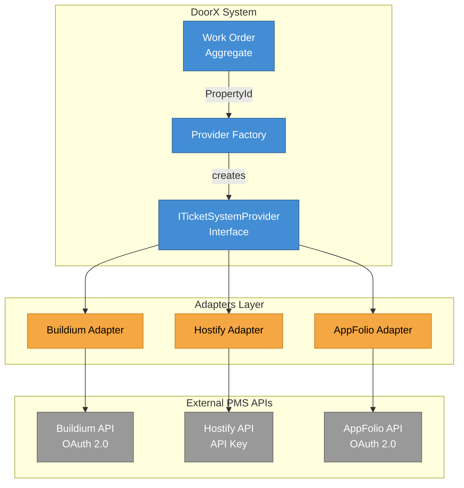
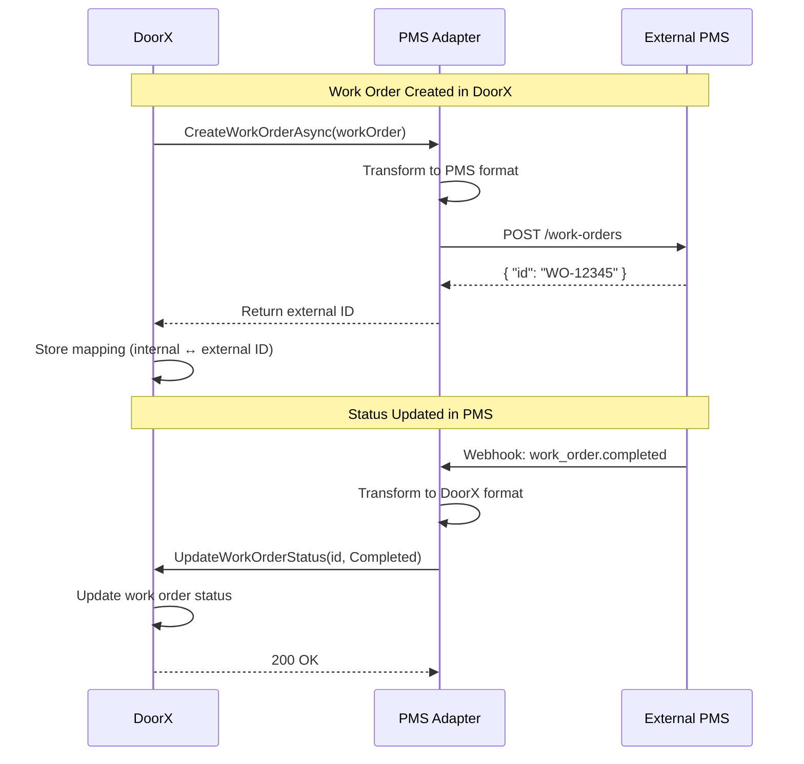
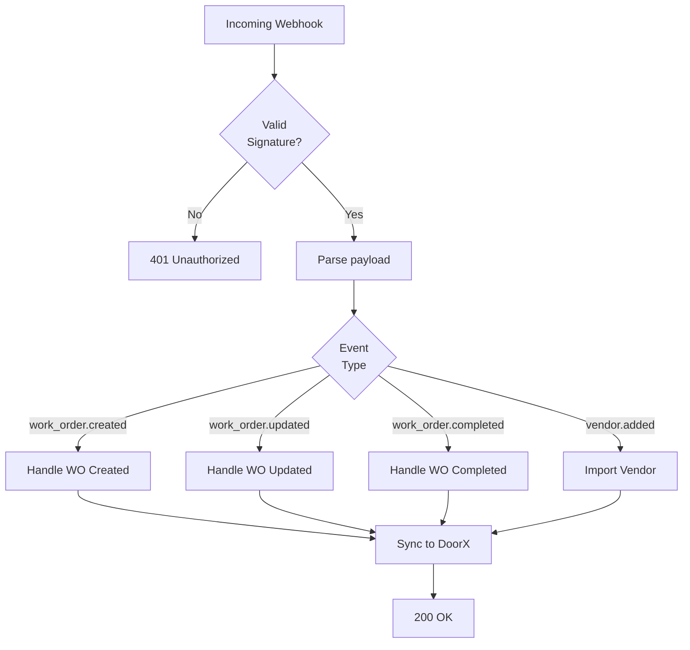

# DoorX - Integration Architecture (PMS)

## Descripción

Arquitectura de integraciones con Property Management Systems externos usando patrón Factory + Adapter.

---

## Integration Pattern



---

## Factory Selection Logic

```csharp
public async Task<ITicketSystemProvider> GetProviderForPropertyAsync(PropertyId propertyId)
{
    // 1. Get property configuration
    var property = await _propertyRepository.GetByIdAsync(propertyId);

    // 2. Determine ERP type (cascade: Property → Client → Landlord)
    var erpType = property.PMSConfiguration?.ERPType
                  ?? property.Client?.PrimaryERP
                  ?? property.Landlord?.DefaultPMS
                  ?? ERPType.None;

    // 3. Return appropriate provider
    return erpType switch
    {
        ERPType.Buildium => _buildiumProvider,
        ERPType.Hostify => _hostifyProvider,
        ERPType.AppFolio => _appFolioProvider,
        ERPType.None => _nullProvider, // No external sync
        _ => throw new NotSupportedException($"ERP type {erpType} not supported")
    };
}
```

---

## Adapter Interface

```csharp
public interface ITicketSystemProvider
{
    // Work Order operations
    Task<string> CreateWorkOrderAsync(WorkOrder workOrder);
    Task UpdateWorkOrderStatusAsync(string externalId, WorkOrderStatus status);
    Task<WorkOrder> SyncWorkOrderAsync(string externalId);

    // Vendor operations
    Task<IEnumerable<ExternalVendor>> GetVendorsAsync(ServiceCategory category, Address location);
    Task<ExternalVendor> GetVendorDetailsAsync(string externalVendorId);

    // Property operations
    Task<IEnumerable<ExternalProperty>> GetPropertiesAsync();
    Task SyncPropertyAsync(string externalPropertyId);
}
```

---

## Bidirectional Sync



---

## Data Transformation Example

### DoorX → Buildium

```json
// DoorX Work Order
{
  "id": "550e8400-e29b-41d4-a716-446655440000",
  "tenantId": "tenant_123",
  "propertyId": "prop_456",
  "category": "HVAC",
  "priority": "High",
  "description": "AC not cooling",
  "status": "Open"
}

// Transformed to Buildium format
{
  "property_id": "12345",
  "unit_id": "67890",
  "category": "HVAC",
  "priority": "Urgent",
  "description": "AC not cooling",
  "entry_contact": {
    "name": "John Doe",
    "phone": "+15551234567"
  }
}
```

---

## Webhook Handling



---

## Error Handling & Retry

```yaml
retryPolicy:
  maxAttempts: 3
  backoff: exponential
  initialDelay: 1s
  maxDelay: 30s

circuitBreaker:
  threshold: 5 failures in 1 minute
  timeout: 30s
  halfOpenAfter: 60s
```

---

## Referencias

- [Factory Pattern Implementation](../../../src/Infrastructure/Providers/)
- [Integration Tests](../../../tests/Integration/Infrastructure.IntegrationTests/)
