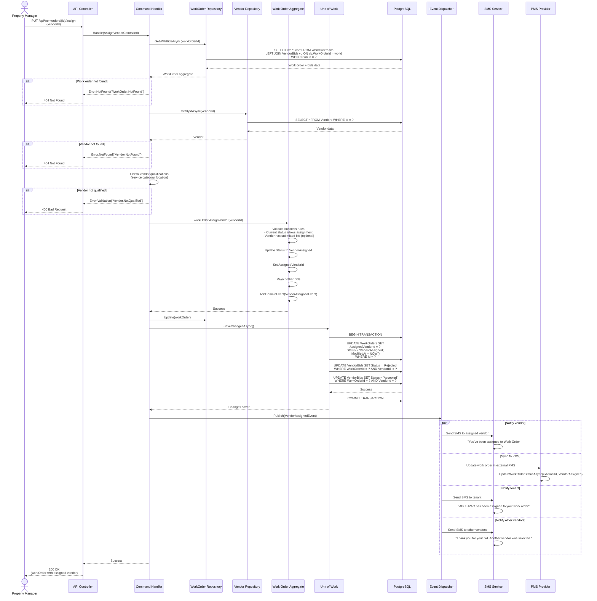
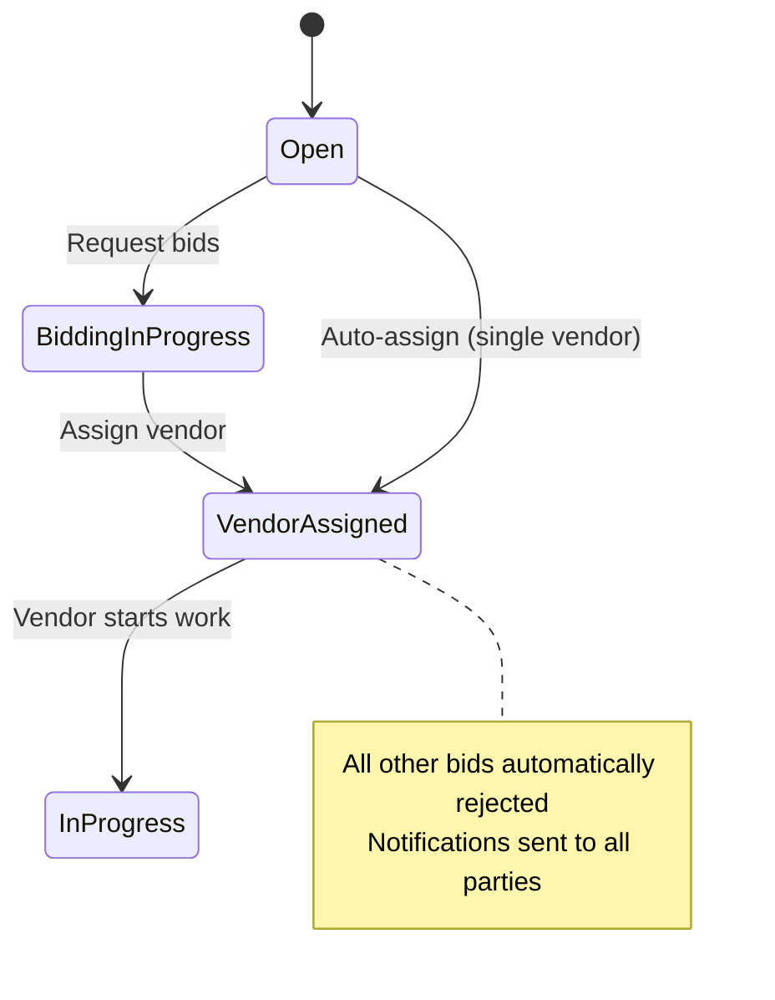

# DoorX - Assign Vendor Sequence

## Descripción

Secuencia detallada del proceso de asignación de un vendor a un work order.

---

## Sequence Diagram



---

## Request/Response Examples

### Request
```http
PUT /api/workorders/770e8400-e29b-41d4-a716-446655440000/assign HTTP/1.1
Authorization: Bearer eyJhbGc...
Content-Type: application/json

{
  "vendorId": "880e8400-e29b-41d4-a716-446655440000"
}
```

### Response (Success)
```http
HTTP/1.1 200 OK
Content-Type: application/json

{
  "id": "770e8400-e29b-41d4-a716-446655440000",
  "status": "VendorAssigned",
  "assignedVendor": {
    "id": "880e8400-e29b-41d4-a716-446655440000",
    "companyName": "ABC HVAC Services",
    "contactName": "John Smith",
    "phoneNumber": "+15559876543",
    "rating": 4.8,
    "bidAmount": 200.00
  },
  "assignedAt": "2024-01-15T11:00:00Z",
  "modifiedAt": "2024-01-15T11:00:00Z"
}
```

---

## Business Rules

1. **Work Order Status**
   - Must be in `Open` or `BiddingInProgress` status
   - Cannot assign if already `VendorAssigned`, `InProgress`, `Completed`, or `Cancelled`

2. **Vendor Qualifications**
   - Vendor must be active (not suspended)
   - Vendor must offer the required service category
   - Vendor's service area must include property location
   - Vendor rating must be ≥ 3.5 (configurable)

3. **Bid Requirements (Optional)**
   - If `requireBid` is enabled, vendor must have submitted a bid
   - Bid amount must be within budget (if budget set)

4. **Multiple Assignments**
   - Only one vendor can be assigned at a time
   - Assigning a new vendor rejects all other pending bids

5. **Notifications**
   - Assigned vendor receives SMS + Email
   - Tenant receives notification with vendor details
   - Other bidding vendors receive rejection notification
   - Property manager receives confirmation

---

## Error Scenarios

| Error | HTTP Code | Message |
|-------|-----------|---------|
| Work order not found | 404 | `WorkOrder.NotFound` |
| Vendor not found | 404 | `Vendor.NotFound` |
| Invalid status transition | 400 | `WorkOrder.InvalidStatusTransition` |
| Vendor not qualified | 400 | `Vendor.NotQualified` |
| Vendor inactive | 400 | `Vendor.Inactive` |
| No bid submitted | 400 | `Vendor.BidRequired` |
| Already assigned | 409 | `WorkOrder.AlreadyAssigned` |

---

## State Transitions



---

## Referencias

- [AssignVendorCommandHandler](../../../src/Application/WorkOrders/Commands/AssignVendor/AssignVendorCommandHandler.cs)
- [WorkOrder.AssignVendor()](../../../src/Domain/WorkOrders/Entities/WorkOrder.cs)
- [VendorAssignedEvent](../../../src/Domain/WorkOrders/Events/VendorAssignedEvent.cs)
