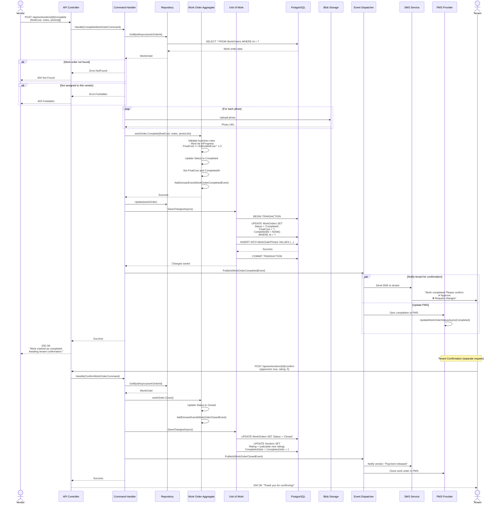
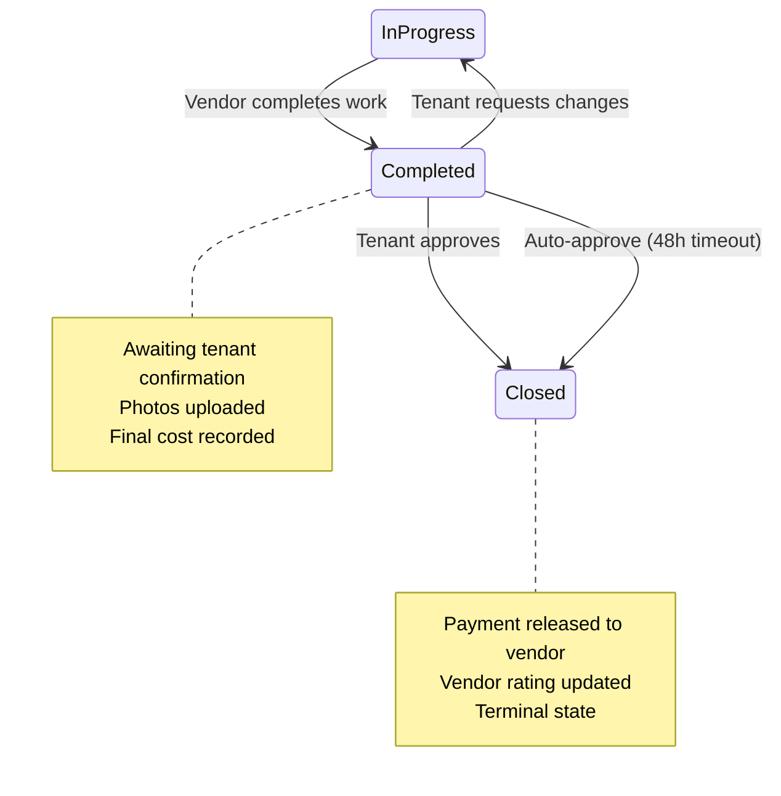
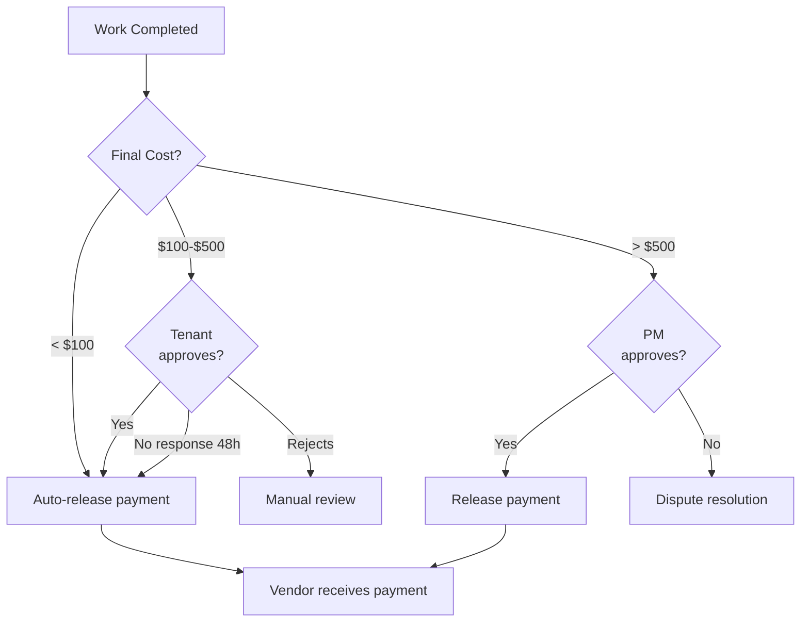

# DoorX - Complete Work Order Sequence

## Descripción

Secuencia del proceso de completar un work order, incluyendo confirmación del tenant y cierre final.

---

## Sequence Diagram



---

## Request/Response Examples

### Request (Vendor Completes)
```http
POST /api/workorders/770e8400-e29b-41d4-a716-446655440000/complete HTTP/1.1
Authorization: Bearer eyJhbGc...
Content-Type: multipart/form-data

{
  "finalCost": 195.00,
  "notes": "Replaced refrigerant and fixed leak in condenser coil",
  "photos": [
    <binary photo 1>,
    <binary photo 2>
  ]
}
```

### Response (Success)
```http
HTTP/1.1 200 OK
Content-Type: application/json

{
  "id": "770e8400-e29b-41d4-a716-446655440000",
  "status": "Completed",
  "finalCost": 195.00,
  "completedAt": "2024-01-16T14:30:00Z",
  "photos": [
    "https://storage.doorx.com/photos/wo-12345-1.jpg",
    "https://storage.doorx.com/photos/wo-12345-2.jpg"
  ],
  "message": "Work marked as completed. Awaiting tenant confirmation."
}
```

### Request (Tenant Confirms)
```http
POST /api/workorders/770e8400-e29b-41d4-a716-446655440000/confirm HTTP/1.1
Authorization: Bearer eyJhbGc...
Content-Type: application/json

{
  "approved": true,
  "rating": 5,
  "feedback": "Great service! Fixed quickly and professionally."
}
```

---

## Business Rules

### Completion Requirements
1. **Work Order Status**
   - Must be `InProgress` to mark as completed
   - Cannot complete if `Open`, `Cancelled`, or already `Completed`

2. **Authorization**
   - Only assigned vendor can mark as completed
   - Property manager can override if needed

3. **Final Cost**
   - Must be provided
   - Warning if exceeds estimated cost by >20%
   - Auto-approve if < $100
   - Requires PM approval if > $500

4. **Proof of Work**
   - At least 1 photo required
   - Photos stored in Azure Blob Storage
   - Maximum 5 photos per work order

### Tenant Confirmation
1. **Approval Options**
   - ✅ Approve: Work order closed, payment released
   - ❌ Request changes: Status back to `InProgress`
   - ⏰ No response after 48h: Auto-approve

2. **Rating**
   - Required (1-5 stars)
   - Updates vendor's overall rating
   - Increments vendor's `CompletedJobs` counter

3. **Auto-Approval**
   - After 48 hours without tenant response
   - Automatic 4-star rating
   - Notification sent to PM

---

## State Transitions



---

## Payment Release Logic



---

## Error Scenarios

| Error | HTTP Code | Message |
|-------|-----------|---------|
| Work order not found | 404 | `WorkOrder.NotFound` |
| Not in InProgress status | 400 | `WorkOrder.InvalidStatus` |
| Not assigned vendor | 403 | `Vendor.Unauthorized` |
| Final cost too high | 400 | `WorkOrder.CostExceedsLimit` |
| No photos provided | 400 | `WorkOrder.PhotosRequired` |
| Photo upload failed | 500 | `Storage.UploadFailed` |

---

## Metrics Tracked

- **Completion Time:** CompletedAt - CreatedAt
- **On-Budget Rate:** FinalCost ≤ EstimatedCost
- **First-Time Fix Rate:** Completed without reopening
- **Tenant Satisfaction:** Average rating per vendor
- **Response Time:** CompletedAt - AssignedAt

---

## Referencias

- [CompleteWorkOrderCommandHandler](../../../src/Application/WorkOrders/Commands/CompleteWorkOrder/)
- [WorkOrder.Complete()](../../../src/Domain/WorkOrders/Entities/WorkOrder.cs)
- [WorkOrderCompletedEvent](../../../src/Domain/WorkOrders/Events/WorkOrderCompletedEvent.cs)
