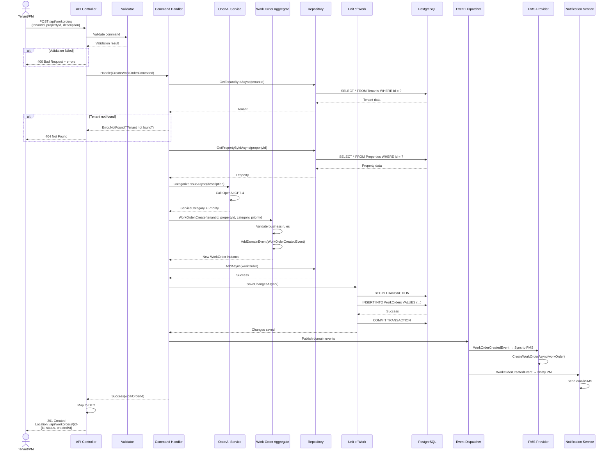

# DoorX - Create Work Order Sequence

## Descripción

Secuencia detallada de la creación de un Work Order desde el API hasta la persistencia y notificaciones.

---

## Sequence Diagram



---

## Request/Response Examples

### Request
```http
POST /api/workorders HTTP/1.1
Authorization: Bearer eyJhbGc...
Content-Type: application/json

{
  "tenantId": "550e8400-e29b-41d4-a716-446655440000",
  "propertyId": "660e8400-e29b-41d4-a716-446655440000",
  "issueDescription": "The air conditioning is not cooling properly. It's been running for hours but the temperature won't drop below 80°F.",
  "contactInfo": {
    "phoneNumber": "+15551234567",
    "email": "john.doe@example.com",
    "preferredChannel": "SMS"
  }
}
```

### Response (Success)
```http
HTTP/1.1 201 Created
Location: /api/workorders/770e8400-e29b-41d4-a716-446655440000
Content-Type: application/json

{
  "id": "770e8400-e29b-41d4-a716-446655440000",
  "tenantId": "550e8400-e29b-41d4-a716-446655440000",
  "propertyId": "660e8400-e29b-41d4-a716-446655440000",
  "category": "HVAC",
  "priority": "High",
  "status": "Open",
  "issueDescription": "The air conditioning is not cooling properly...",
  "createdAt": "2024-01-15T10:30:00Z",
  "estimatedCost": {
    "min": 150.00,
    "max": 350.00,
    "currency": "USD"
  }
}
```

### Response (Validation Error)
```http
HTTP/1.1 400 Bad Request
Content-Type: application/problem+json

{
  "type": "https://tools.ietf.org/html/rfc7231#section-6.5.1",
  "title": "One or more validation errors occurred.",
  "status": 400,
  "errors": {
    "issueDescription": ["Issue description cannot be empty"],
    "tenantId": ["Tenant ID is required"]
  }
}
```

---

## Business Rules Enforced

1. **Tenant Validation**
   - Tenant must exist
   - Tenant must be active (not suspended)
   - Tenant must be assigned to the property

2. **Property Validation**
   - Property must exist
   - Property must be active

3. **Issue Description**
   - Minimum 10 characters
   - Maximum 1000 characters
   - Cannot be empty or whitespace

4. **AI Categorization**
   - Falls back to "Other" if confidence < 70%
   - Manual review required for low confidence

5. **Priority Assignment**
   - Emergency keywords: "leak", "fire", "gas", "emergency"
   - High keywords: "broken", "not working", "urgent"
   - Default: Medium

---

## Performance Considerations

- **Database queries:** 2 SELECTs + 1 INSERT (optimized)
- **AI call:** ~500ms average (async, non-blocking)
- **Total latency:** < 1 second (P95)
- **Caching:** Tenant and Property data cached in Redis (5 min TTL)

---

## Error Scenarios

| Error | HTTP Code | Response |
|-------|-----------|----------|
| Tenant not found | 404 | `{ "error": "Tenant.NotFound" }` |
| Property not found | 404 | `{ "error": "Property.NotFound" }` |
| Tenant inactive | 403 | `{ "error": "Tenant.Inactive" }` |
| AI service unavailable | 503 | Falls back to manual categorization |
| Database timeout | 500 | Retry with exponential backoff |

---

## Referencias

- [CreateWorkOrderCommandHandler](../../../src/Application/WorkOrders/Commands/CreateWorkOrder/CreateWorkOrderCommandHandler.cs)
- [WorkOrder Aggregate](../../../src/Domain/WorkOrders/Entities/WorkOrder.cs)
- [API Controller](../../../src/API/Controllers/WorkOrdersController.cs)
